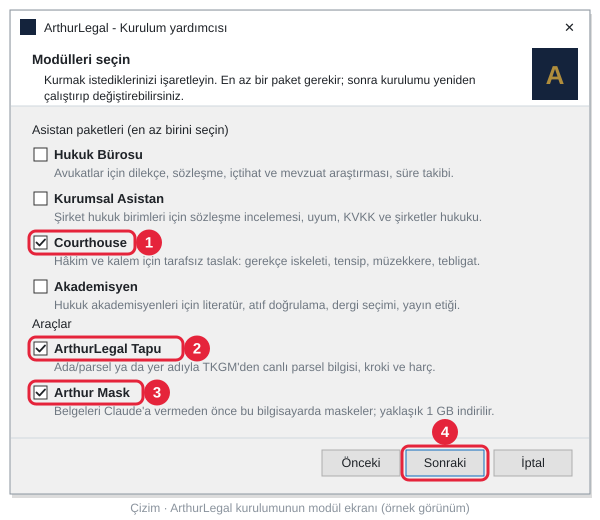
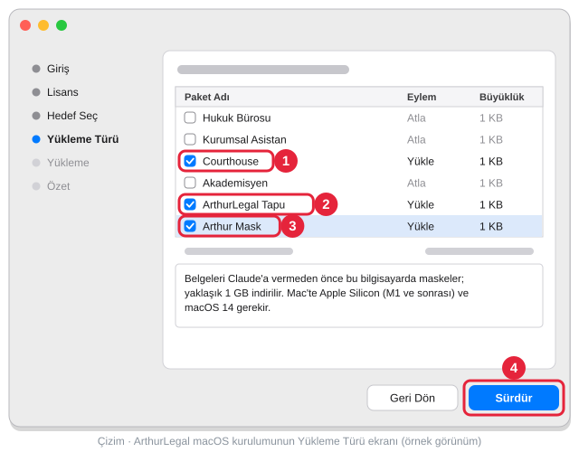

<h1 id="indir">ArthurLegal Courthouse</h1>

<p align="center">
  <a href="https://github.com/beerbottle90/ArthurLegal/releases/latest/download/ArthurLegal-Kurulum.exe"></a><br>
  <a href="https://github.com/beerbottle90/ArthurLegal/releases/latest/download/ArthurLegal-Kurulum.pkg"></a>
</p>
<p align="center">
  <b>Windows 10 / 11</b> (64 bit) · <b>macOS 11+</b> (Apple Silicon · Intel) · yönetici şifresi istemez<br>
  <a href="https://github.com/beerbottle90/ArthurLegal/releases/latest"></a>
</p>

**Hâkim ve kalem için tarafsız taslak asistanı.** ArthurLegal Courthouse; gerekçeli karar iskeleti, ön inceleme,
tensip zaptı, müzekkere, tebligat, duruşma tutanağı, kanun yolu ve süre kontrolü gibi işlerde Türk usul hukukuna
uygun **taslak** hazırlar. Asistan karar vermez ve sonuç önermez: iki tarafı dengeli inceler, kaynağını gösterir;
her çıktı **"MAHKEME DAHİLİ ÇALIŞMA NOTU — TASLAK"** başlığını taşır ve hâkim ya da heyet onayından geçer.

Kurulumdan sonra masaüstünde üç simge olur:

| Simge | Ne açar |
|---|---|
| **ArthurLegal - Courthouse** | Claude Desktop'u ve başlangıç panelini açar; sohbette asistan Courthouse talimatıyla çalışır |
| **ArthurLegal - Tapu** | Ada/parsel ya da yer adıyla TKGM Parsel Sorgu'dan canlı parsel bilgisi, kroki ve harç |
| **Arthur Mask** | Dosya belgelerini Claude'a vermeden önce bu bilgisayarda maskeler |

Mac'te simgeler Uygulamalar klasöründe de durur ve adlarında tire yoktur: **ArthurLegal Courthouse**,
**ArthurLegal Tapu**.

Sürüm: **Courthouse v1.2.1** (2026-10-07) · kurulum dosyası ArthurLegal Setup 2.5.0 ve sonrası (Mac: 2.6.0) ·
[sürüm notları](CHANGELOG.md) · [lisans](LICENSE)

---

<h2 id="kurulum">İndirme ve kurulum: dört adım</h2>

Aşağıdaki adımlar Windows içindir; Mac'te kurulum [aşağıda](#mac). Düğme açılmazsa bu bağlantıya tıklayın:
**[ArthurLegal-Kurulum.exe](https://github.com/beerbottle90/ArthurLegal/releases/latest/download/ArthurLegal-Kurulum.exe)**.
Bağlantı her zaman en son sürümü indirir. Kurduktan sonra ArthurLegal yeni sürümleri arka planda, imzalarını
doğrulayarak kendisi kurar; bu dosyayı yeniden indirmeniz gerekmez.

**Gerekenler:** Windows 10 ya da 11 (64 bit), internet bağlantısı ve bir Claude hesabı. Claude Desktop kurulu
değilse kurulum onu da kurmayı dener. Arthur Mask için yaklaşık 4 GB boş disk; 8 GB bellek önerilir.

**1. İndirin.** Yukarıdaki düğmeye tıklayın. Dosya tarayıcının sağ üstündeki indirmeler listesine iner; liste
kapanırsa <kbd>Ctrl</kbd> + <kbd>J</kbd> ile açın.

**Edge** "**ArthurLegal-Kurulum.exe yaygın olarak indirilen bir dosya değil**" derse dosya silinmedi, onayınızı
bekliyor. Satırdaki çöp kutusuna basmayın:

1. Fareyle satırın üzerine gelin, sağda beliren **⋯** düğmesine, sonra **Sakla**'ya tıklayın.
2. Açılan pencerede mavi **Sil** düğmesine değil, hemen yanındaki küçük oka (**˅**) tıklayın ve
   **Yine de sakla**'yı seçin. Eski Edge sürümlerinde bu pencerede önce **Daha fazla göster**'e tıklanır.

<p align="center">
  
  
</p>

**Chrome** "**Şüpheli indirme işlemi engellendi**" derse: sağ üstteki indirme simgesine, sonra dosyanın satırına
tıklayın ve **Şüpheli dosyayı indir**'i seçin. **Geçmişten sil** dosyayı atar.

**2. Çift tıklayın.** İndirilen **ArthurLegal-Kurulum** dosyasını açın; Edge'de dosya adının altındaki
**Dosya aç**'a da tıklayabilirsiniz. Mavi bir pencerede "**Windows kişisel bilgisayarınızı korudu**" yazarsa
korkmayın, kod imzası taşımayan her yeni programda çıkar. Fareyle önce **Ek bilgi** yazısına, sonra beliren
**Yine de çalıştır** düğmesine tıklayın. <kbd>Enter</kbd>'a basmayın: Enter **Çalıştırma**'yı seçer, kurulum açılmaz.

<p align="center">
  
  
</p>

**3. Modülleri seçin.** Kurulum önce dili sorar: **Türkçe**'yi seçip **Tamam**'a (OK) tıklayın.
**Anlaşmayı kabul ediyorum**'u seçip **Sonraki**'ye tıklayın. **Modülleri seçin** ekranında her modülün altında
ne işe yaradığı yazar; ilk kurulumda hiçbir kutu işaretli gelmez. Şunları işaretleyin:

1. **Courthouse**: hâkim ve kalem paketi. Bu sayfanın anlattığı asistan budur.
2. **ArthurLegal Tapu**: tapu iptal ve tescil, ortaklığın giderilmesi, kamulaştırma, ecrimisil gibi dosyalarda
   parsel bilgisi, kroki ve harç için.
3. **Arthur Mask**: dosya belgelerini (UYAP UDF, Word, PDF, tarama) Claude'a vermeden önce bilgisayarda maskelemek
   için. Kurulum sırasında yaklaşık 1 GB iner.
4. Sonra **Sonraki**'ye tıklayın.

Hukuk Bürosu, Kurumsal Asistan ve Akademisyen başka meslekler içindir; gerekmiyorsa boş bırakın. Hiç paket
seçmeden ilerlenmez.

<p align="center">
  
</p>

**4. Kurun.** **Kurulmaya hazır** sayfası seçtiğiniz modülleri listeler. **Kur**'a tıklayın. Claude Desktop
açıksa kurulum onu kapatır; başlamadan önce yazdığınız mesajı gönderin. Arthur Mask'in indirilmesi internet
hızınıza göre birkaç dakika sürer; beklemek istemezseniz **İndirmeyi durdur**'a basıp çıkan iki soruya
**Evet** deyin, Arthur Mask sonra arka planda kendiliğinden iner. Son sayfada **Bitti**'ye tıklayın: başlangıç
paneli ve Claude Desktop açılır, masaüstünde **ArthurLegal - Courthouse**, **ArthurLegal - Tapu** ve
**Arthur Mask** simgeleri olur.

<h3 id="mac">Mac'te kurulum</h3>

**[ArthurLegal-Kurulum.pkg](https://github.com/beerbottle90/ArthurLegal/releases/latest/download/ArthurLegal-Kurulum.pkg)**: macOS 11 ve sonrası, Apple Silicon ve Intel Mac'ler için tek dosya; yönetici
şifresi istemez. Arthur Mask Mac'te Apple Silicon (M1 ve sonrası) ve macOS 14 (Sonoma) ya da sonrasını ister.

**1. İndirin ve açın.** İndirilen **ArthurLegal-Kurulum.pkg** dosyasına çift tıklayın. Kurulum dosyası henüz
Apple'ın noter onayını taşımadığı için macOS ilk açılışta "**“ArthurLegal-Kurulum.pkg” Açılmadı**" der: **Bitti**'ye
tıklayın (mavi **Çöp Sepeti’ne Taşı**'ya değil; <kbd>Enter</kbd>'a da basmayın). **Sistem Ayarları → Gizlilik ve Güvenlik**'i açıp sayfanın altındaki **Yine de Aç**'a tıklayın, parolanızı
girin ve çıkan pencerede yine **Yine de Aç**'ı seçin. Bunu yalnız ilk açılışta bir kez yaparsınız.

<p align="center">
  
  
</p>

**2. Modülleri seçin.** **Sürdür**'e tıklayarak ilerleyin; lisanstan sonra **Kabul Ediyorum**'u seçin. **Yükleme
Türü** ekranında **Courthouse**, **ArthurLegal Tapu** ve **Arthur Mask**'i işaretleyip **Sürdür**'e tıklayın;
bir modülün adına tıklayınca ne işe yaradığı altta yazar.

<p align="center">
  
</p>

**3. Kurun.** Sonraki sayfada **Yükle**'ye, son sayfada **Kapat**'a tıklayın: başlangıç paneli tarayıcıda açılır. Masaüstünde ve
Uygulamalar klasöründe **ArthurLegal Courthouse** ve **ArthurLegal Tapu** simgeleri olur. Arthur Mask kurulumdan
sonra arka planda iner (yaklaşık 1,2 GB); hazır olunca bildirim gelir ve masaüstüne **Arthur Mask** simgesi
eklenir.

**4. Claude Desktop'u yeniden açın.** Açıksa **Cmd+Q** ile tamamen çıkıp yeniden açın; kurulu değilse
[claude.ai/download](https://claude.ai/download) adresinden kurun. Sonrası aşağıdaki **İlk kullanım** ile aynıdır.
Kaldırmak için: Uygulamalar → ArthurLegal → **ArthurLegal'i Kaldır**.

<h3 id="ilk-kullanim">İlk kullanım</h3>

Claude Desktop'ta yeni bir sohbet açıp işi yazın; asistan Courthouse talimatını ve bilgi dosyalarını kendisi
yükler. Proje açmak, talimat yapıştırmak ya da dosya yüklemek gerekmez. Claude bir aracı ilk kez kullanırken izin
sorarsa **Always allow**'u (Her zaman izin ver) seçin; Claude Desktop'un menüleri İngilizcedir.

```text
/hukuk-hakim:on-inceleme
[dosyanın özeti, ya da Arthur Mask'te hazırlanmış belgenin numarası]
```

Bir eklentinin bütün komutlarını görmek için sohbete yalnız adını yazın, örneğin `/hukuk-kalem:`. İzleyiciler
komutla değil cümleyle çalışır: "yarının duruşmaları", "sabah tutuklu listesi", "kesinleşme kontrolü". Önce
`knowledge/mahkeme-profili.md` dosyasındaki mahkeme bilgilerini doldurmak isterseniz asistana "mahkeme profilini
birlikte dolduralım" deyin. Komutların tam listesi: [KURULUM.md](KURULUM.md#komut-haritası-v120).

<details>
<summary><b>Bu uyarılar neden çıkıyor, dosya güvenli mi?</b></summary>

Windows ve tarayıcılar, az indirilmiş ve kod imzası taşımayan her programı tanımadıkları için uyarır. ArthurLegal
kurulum dosyası henüz ücretli bir kod imzalama sertifikasıyla imzalanmadı; yayımcının "bilinmeyen" görünmesi
bundandır, dosyanın zararlı olduğu anlamına gelmez. Yine de yalnız bu sayfadaki düğmeden ya da
[yayın sayfasından](https://github.com/beerbottle90/ArthurLegal/releases/latest) indirdiğiniz dosya için
devam edin; e-postayla ya da başka bir siteden gelen kopyayı açmayın. Kurulumdan sonraki güncellemeler
ayrıca dijital imzayla doğrulanır: imza tutmazsa hiçbir şey kurulmaz.

İnternet bağlantısı yokken mavi pencere "**SmartScreen'e şu anda ulaşılamıyor**" der; orada **Çalıştır**'a
tıklayın. Kuruluşunuzun yönettiği bir bilgisayarda **Sakla** ya da **Yine de sakla** soluk görünüyorsa
("Kuruluşunuz tarafından yönetilir") ya da yazılım kurma izniniz yoksa kurulum için bilgi işlem sorumlunuza
başvurun.
</details>

<details>
<summary><b>"Yine de çalıştır" hiç çıkmıyor ya da "Uygulama Denetimi" engeli var (Windows 11)</b></summary>

Bilgisayarınızda Windows 11'in **Akıllı Uygulama Denetimi** açık. Bu denetim imzasız kurulum dosyalarına hiç
izin vermez. Denetimi kapatmanız gerekmez; aynı kurulumun zip yolunu kullanın:

1. **[ArthurLegal-Kurulum.zip](https://github.com/beerbottle90/ArthurLegal/releases/latest/download/ArthurLegal-Kurulum.zip)**
   dosyasını indirin (bu bağlantı da her zaman en son sürümü verir).
2. Ayıklamadan önce zip dosyasına sağ tıklayıp **Özellikler**'i açın. **Genel** sekmesinin altında "Bu dosya
   başka bir bilgisayardan geldi…" yazıyorsa yanındaki **Engellemeyi Kaldır** kutusunu işaretleyip **Tamam**'a
   tıklayın.
3. Zip dosyasına sağ tıklayın, **Tümünü Ayıkla...**'yı, sonra **Ayıkla**'yı seçin.
4. Açılan klasörde **KUR** dosyasına (türü: Windows Komut Dosyası) çift tıklayın. Siyah pencere modülleri sorar:
   Courthouse ve Tapu için `3,5` yazıp <kbd>Enter</kbd>'a basın. Sizden bir tuşa basmanızı isteyince kurulum bitmiştir.

Bu yolla Arthur Mask kurulmaz (dosya belgesi maskeleme çalışmaz); Courthouse paketi, araştırma araçları ve
Tapu çalışır.
</details>

<details>
<summary><b>Tarayıcıda claude.ai kullanıyorum</b></summary>

Kurulum dosyaları Claude Desktop içindir (Windows ve Mac). claude.ai web'de Courthouse paketi Claude.ai Projects ile
elle kurulur: [KURULUM.md](KURULUM.md#elle-kurulum-4-adım). Arthur Mask yalnız Claude Desktop'ta çalışır (Windows ve
Apple Silicon Mac); web ve mobil uygulamada çalışmaz.
</details>

<details>
<summary><b>Sessiz kurulum (bilgi işlem için)</b></summary>

Kurulum dosyası pencere açmadan da çalışır; modüller komut satırında verilir:

```text
ArthurLegal-Kurulum.exe /VERYSILENT /SUPPRESSMSGBOXES /MODULLER=adliye,tapu,mask
```

Modül adları: `hukuk-burosu`, `kurumsal`, `adliye` (Courthouse), `akademisyen`, `tapu`, `mask`. En az bir
paket gerekir; geçersiz bir liste verilirse kurulum hiçbir şey kurmadan durur. Kurulum kullanıcı kapsamındadır
(`%LOCALAPPDATA%\Programs\ArthurLegal`), yönetici yetkisi istemez. Modül eklemek ya da çıkarmak için kurulum
dosyası yeniden çalıştırılır; aynı bilgisayarda son seçim işaretli gelir.

Mac'te aynı iş macOS'un `installer` komutuyla, kullanıcının ev klasörüne yapılır
(`~/Library/Application Support/ArthurLegal`); seçim bir XML dosyasıyla verilir (biçimi:
`installer -showChoicesXML -pkg ArthurLegal-Kurulum.pkg`, modül kimlikleri yukarıdakilerle aynı):

```text
installer -pkg ArthurLegal-Kurulum.pkg -target CurrentUserHomeDirectory -applyChoiceChangesXML secim.xml
```
</details>

Bu sayfayı paylaşmak için bağlantı: **https://github.com/beerbottle90/ArthurLegal#courthouse** (sürüm değişse de aynı kalır)

---

## Ne yapar

**Temel ilke:** asistan karar vermez. İki tarafın iddia ve savunmasını dengeli inceler, gerekçe iskeleti ve usul
kontrolü üretir; nihai değerlendirme hâkime ya da heyete aittir. Her madde ve içtihat atfı bu sohbette resmî
kaynaktan çekilir; çekilemeyen bilgi uydurulmaz, yerine açık bir satır yazılır:
`UYARI: veri çekilemedi, teyidiniz gerekli: <resmî giriş sayfası>`.

| | Hukuk Bürosu ve Kurumsal paketler | **Courthouse** |
|---|---|---|
| Kimin için | Avukat, hukuk bürosu, şirket hukuk birimi | **Mahkeme hâkimi ve kalem** |
| Bakış | Taraf vekili | **Yargısal, tarafsız** |
| Amaç | Müvekkil lehine taslak | **Gerekçe ve usulü yapılandırmak** |
| Atıf | Katı | **Karara girecek kadar katı: doğrulanmadan yazılmaz** |
| Belge başlığı | GİZLİDİR – HUKUK MÜŞAVİRLİĞİ | **MAHKEME DAHİLİ ÇALIŞMA NOTU — TASLAK** |

### 12 eklenti

Paket 12 eklentiden (plugin) ve onların 56 işinden (skill) oluşur: dört yargı kolu için hâkim ve kalem
eklentileri, istinaf dairesi ve kalemi, iki ortak alan.

| Kol | Usul | Hâkim | Kalem |
|---|---|---|---|
| **Hukuk** | HMK | `hukuk-hakim`: gerekçeli karar, ön inceleme, delil değerlendirme, ihtiyati tedbir, ara karar, bilirkişi raporu denetimi, dava şartı kontrolü | `hukuk-kalem`: tensip zaptı, tebligat, harç hesabı, duruşma tutanağı, istinafa gönderme, kesinleşme şerhi |
| **Ceza** | CMK | `ceza-hakim`: hüküm taslağı, iddianame değerlendirme, tutuklama ve tutukluluk incelemesi, HAGB, uzlaştırma denetimi, gerekçe denetimi | `ceza-kalem`: müzekkere, tebligat, infaz evrakı, duruşma tutanağı, kanun yoluna gönderme |
| **İdari** | İYUK | `idari-hakim`: karar, yürütmenin durdurulması, ehliyet ve husumet, ivedi yargılama, ara karar | `idari-kalem`: dosyanın tekemmülü, tebligat, kararın uygulanmasının takibi, kanun yoluna gönderme |
| **Vergi** | VUK ve İYUK | `vergi-hakim`: karar, tarhiyat değerlendirme, ödeme emrine itiraz, vergi cezası | `vergi-kalem`: tebligat, süre takibi, karar uygulaması ve iade, dosyanın tekemmülü |
| **İstinaf** | HMK, CMK, İYUK kanun yolu | `istinaf-hakim`: hukuk ön inceleme ve esas karar, ceza istinaf incelemesi, idari istinaf | `istinaf-kalem`: dosya kabul kontrolü, geri çevirme, karar sonrası işlemler |
| **Ortak** | — | `yargi-arastirma`: içtihat künyesi doğrulama, karşı görüş taraması, emsal tarama, AYM ve AİHM standart kontrolü | `karar-yayim`: anonimleştirme, sade dil özeti, karar künye özeti |

- **Mahkeme türü profilleri (10):** asliye hukuk, asliye ticaret, iş, aile, tüketici, sulh hukuk, icra hukuk,
  asliye ve ağır ceza, sulh ceza hâkimliği, idare ve vergi mahkemeleri. Her profil görev ve yetkiyi, usul akışını,
  kritik süreleri, sık usul risklerini ve kalem iş akışını taşır; asistan mahkeme profilindeki türe göre ilgili
  profili okur.
- **İzleyiciler (7):** tutukluluk incelemesi, duruşma hazırlığı, kanun yolu ve kesinleşme, bilirkişi raporları,
  mevzuat değişikliği, içtihat ve AYM kararları, makul süre. Kullanıcı tetikler; zamanlanmış çalışma yoktur ve
  asistan UYAP'a bağlanmaz. Girdi, kullanıcının verdiği ya da kalemin UYAP'tan dışa aktardığı listedir; liste
  yoksa izleyici liste uydurmaz. Gösterilen her gün bir hatırlatmadır; son günü hâkim ve kalem teyit eder.
- **36 referans:** usul madde haritaları, kanun yolu ve süreler, adli tatil, dava şartı arabuluculuk, makul süre,
  gerekçeli karar hakkı, içtihat doğrulama, karşı görüş, anonimleştirme, sade dil, yargıda yapay zekâ kullanımının
  sınırları, tebligat ve e-tebligat, harç ve giderler, bilirkişilik, tapu-kadastro.

Paketteki her kanun maddesi atfı resmî metinden çekildi; maddeye yüklenen içerik başlığıyla ve metniyle
karşılaştırıldı.

## Kaynaklar

| Kaynak | Ne verir |
|---|---|
| **ArthurLegal araştırma bağlantısı** (`tr_` önekli araçlar) | Yargıtay, Danıştay, bölge adliye mahkemeleri, yerel mahkemeler ve kanun yararına bozma kararları; Anayasa Mahkemesi ve Uyuşmazlık Mahkemesi kararları; mevzuat metni, madde ağacı ve gerekçe; Resmî Gazete; sekiz düzenleyici kurumun kararları ve anlamsal arşiv. Kurulumla gelir, ayrıca bağlantı eklemek gerekmez |
| **ArthurLegal Tapu** | TKGM Parsel Sorgu'nun herkese açık verisinden canlı parsel, parsel raporu, ölçekli kroki ve harç. Bilgi amaçlıdır: bilirkişi raporu, kadastro ve tapu kaydı yerine geçmez; malik ve şerh bilgisi içermez |
| İsteğe bağlı ek bağlantılar | AİHM, KİK, Sayıştay ve öteki kaynaklar için ikinci bir bağlantı; karşılaştırmalı hukuk için ABD ve İsviçre içtihadı |

Araştırma sorgularına taraf adı ya da dosyaya özgü gizli bilgi yazılmaz; asistan hukuki soruyu soyut terimlerle
araştırır. Ayrıntı: `knowledge/references/yargi-mcp-rehberi.md` ve `mevzuat-mcp-rehberi.md`.

## Arthur Mask: belgeler bilgisayardan çıkmadan maskelenir

Dava, soruşturma ve kovuşturma dosyalarındaki belgeler Claude'a verilmeden önce **kendi bilgisayarınızda**
maskelenir. UYAP UDF, Word, PDF ya da taranmış belge Arthur Mask'e bırakılır; taraf, şüpheli, sanık, mağdur ve
tanık adları, TCKN, adres, telefon ve dosya numarası gibi bilgiler `{{KİŞİ-01}}` gibi etiketlere dönüşür, gerçek
değerler bilgisayardaki şifreli kasada kalır. Claude yalnız maskeli metni görür; cevap bilgisayarınızda gerçek
adlarla Word'de ya da UYAP editöründe açılır.

- **Korumalar:** belirsiz tespitler için inceleme ekranı · kırmızı hat (gerekçe yazılmadan gönderilmez) · Claude'a
  giden her yanıtın kasaya karşı son taraması · gönderim kaydı ve sızıntı denetimi.
- **Tamamen çevrimdışı:** tespit ve metin tanıma modelleri kurulumun içindedir.
- **Yalnız Claude Desktop'ta** çalışır; claude.ai web ve mobil uygulamada çalışmaz.
- **Takma adlandırmadır, anonim hâle getirme değildir.** Tespit olasılığa dayanır; tarihler ve tutarlar bilerek
  maskelenmez. Kişisel verilerin korunması, dosya gizliliği ve kurum kuralları bakımından sorumluluk kullanıcıdadır;
  gizlilik ya da kısıtlama kararı olan dosyalar maskeli olsa bile kurum kuralları izin vermedikçe verilmez.

Kullanım rehberi: [ARTHUR-MASK.md](ARTHUR-MASK.md).

## Sınırlamalar

- **Yargısal karar değildir.** Bütün çıktılar hâkim ya da heyet incelemesinden önce taslaktır.
- **Süreler hatırlatmadır.** İzleyicilerin ve işlerin gösterdiği günleri hâkim ve kalem UYAP kaydından teyit eder;
  olgu bilinmiyorsa en erken gün ve uyarı yazılır.
- **Mevzuat ve içtihat değişebilir.** Kritik karardan önce UYAP ve Resmî Gazete'den doğrulayın.
- **Arthur Mask** resim, el yazısı, imza, kaşe ve karekodu maskelemez.
- **Kurum kuralları önce gelir.** Harici bir yapay zekâ hizmetinin kullanılıp kullanılamayacağı ve hangi belgenin
  verilebileceği kullanıcının bağlı olduğu kuralların konusudur; paket bu kuralların yerine geçmez.

## Paket içeriği

```
ArthurLegal-Courthouse-v1.2.1-Public-Release/
├── README.md              ← bu sayfa
├── KURULUM.md             ← kurulum rehberi: kurulum dosyası ve elle kurulum, komut haritası
├── ARTHUR-MASK.md         ← Arthur Mask kullanım rehberi
├── SYSTEM_PROMPT.md       ← asistanın sistem talimatı
├── CHANGELOG.md           ← sürüm notları
├── VERSION.md             ← 1.2.1
├── ATTRIBUTION.md         ← atıf bilgisi
├── LICENSE                ← Proprietary — Non-Commercial
└── knowledge/
    ├── mahkeme-profili.md      mahkeme profil şablonu ([DOLDUR] alanları)
    ├── profiles/               10 mahkeme türü profili
    ├── agents/                 7 izleyici
    ├── skills/                 12 eklenti, 56 iş
    └── references/             36 referans
```

Önceki sürümler: [arsiv/](../arsiv/README.md).

## Lisans

Bu paket bir bütün olarak ArthurLegal Proprietary Non-Commercial License kapsamındadır: [LICENSE](LICENSE).
**Ticari kullanım yasaktır**; yazılımı satmak, alt lisanslamak, yeniden dağıtmak ya da ürün veya barındırılan
hizmet olarak sunmak yazılı izne bağlıdır. Tüm hakları saklıdır.

Paketin türetildiği üçüncü taraf bilgi tabanı (Anthropic `claude-for-legal`) Apache License 2.0 altındadır; lisans
ve atıf bildirimi [LICENSE-APACHE-2.0-THIRD-PARTY.txt](LICENSE-APACHE-2.0-THIRD-PARTY.txt) dosyasında korunmuştur
ve kaldırılamaz. Atıf: [ATTRIBUTION.md](ATTRIBUTION.md).
