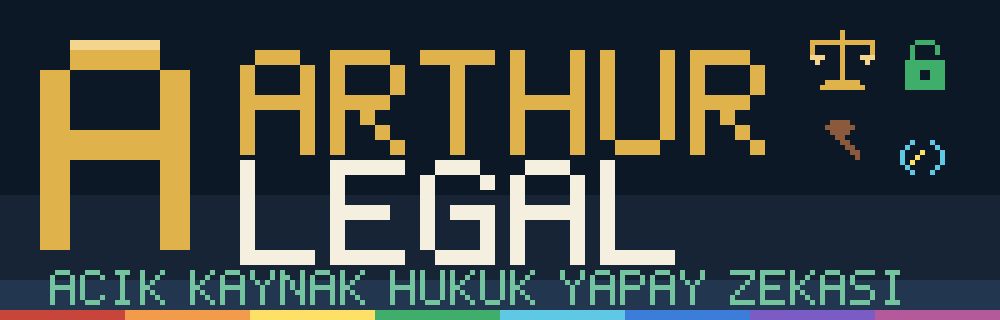

# ArthurLegal Setup v2.1.1

**Tek dosyalık Windows kurulumu.** Avukat indirir, çift tıklar; ArthurLegal Hukuk Bürosu ve Kurumsal
Asistan paketleri, araştırma bağlantıları ve yerel araçlar Claude Desktop'a kendiliğinden bağlanır.
Yönetici yetkisi gerekmez. Sonraki sürümler arka planda, imzası doğrulanarak sessizce kurulur.

> Paketlerin kendisi (SYSTEM_PROMPT + knowledge) bu deponun kökündedir ve Claude.ai'de elle de
> kurulabilir: `ArthurLegal-Law-Firm-v*/KURULUM.md`. Bu klasör, o kurulumu tek tıka indiren ve
> güncel tutan Windows paketidir.

## Ne kurulur

| Bileşen | Nerede çalışır | Ne yapar |
|---|---|---|
| **arthurlegal-yerel** | Claude Desktop · gömülü Python 3.12 | İki paketin sistem talimatını ve 230+ bilgi dosyasını araç olarak sunar; `arthurlegal-mcp.fly.dev` araştırma araçlarını (TR + 14 yargı çevresi, 100+ araç) köprüler. Ayrıca connector eklemeye gerek kalmaz |
| **arthur-tapu** | Claude Desktop + masaüstü kısayolu | tkgm-mcp 0.5.0: TKGM Parsel Sorgu'dan canlı parsel (dakikada en çok 30 istek, sohbet başına onay kartı), parsel raporu, kroki, harç, tapu kaydı maskeleme, Word/Excel çıktı, yerel tarayıcı arayüzü |
| **arthur-mask** | Claude Desktop + kendi arayüzü | Müvekkil belgelerini bilgisayarda maskeleyen gizlilik kapısı. Kurulum sırasında indirilir (≈1 GB), isteğe bağlı |
| *arthur-uyap* | (bu pakette yok) | UYAP köprüsü ayrı dağıtılır; kurulum, bilgisayarda varsa kendiliğinden bağlar |

Claude Desktop kurulu değilse `winget` ile kullanıcı kapsamında kurulur.

## Kurulum

1. **[Releases](https://github.com/beerbottle90/ArthurLegal/releases)** sayfasından `ArthurLegal-Kurulum.exe`
   dosyasını indirin ve çift tıklayın. Windows "bilinmeyen yayımcı" derse **Ek bilgi → Yine de çalıştır**.
2. Claude Desktop'ta **yeni bir sohbet açıp hukuki sorunuzu doğrudan yazın.** Proje ya da yapıştırma
   gerekmez: `arthurlegal_talimat` aracının açıklaması ve sunucunun `instructions` alanı modele "hukukla
   ilgili her soruda önce beni çağır" der; profil verilmezse kurulumdaki varsayılan kullanılır.
3. İlk araç kullanımında çıkan izin penceresinde **Her zaman izin ver**'i seçin. Araç izinleri Claude
   Desktop'ın kendi deposunda tutulur; kurulum bunları önceden işaretleyemez.

**Yedek yollar.** (1) Kurulum `%USERPROFILE%\ArthurLegal\Hukuk Bürosu` ve `...\Kurumsal` proje klasörlerini
hazırlar (`CLAUDE.md`, `SYSTEM_PROMPT.md`, `knowledge/`; güncelleyici her sürümde yeniler, kullanıcının
kendi dosyalarına dokunmaz): Claude'da **Projeler → Yeni proje → Use a folder** ile seçilir.
(2) Başlangıç panelindeki kısa talimat bir projenin Talimatlar alanına yapıştırılır. (3) Sohbette **+**
menüsünden `arthurlegal-yerel` altındaki `hukuk-burosu` istemi seçilir.

**Windows 11 Akıllı Uygulama Denetimi (Smart App Control) açıksa** imzasız kurulum motoru engellenir
(`Hata 4551`). O bilgisayarda `ArthurLegal-Kurulum.zip` dosyasını indirin, klasöre çıkarın ve
`KUR.cmd` dosyasına çift tıklayın: aynı kurulumu imzalı Python ile yapar. Denetim durumu:
`(Get-MpComputerStatus).SmartAppControlState`.

Kaldırma: **Ayarlar → Uygulamalar → ArthurLegal**, ya da zip yoluyla kurulduysa kurulum klasöründeki
`KALDIR.cmd`.

## Güncelleme

Oturum açılışında ve Claude Desktop açıkken altı saatte bir, en son yayındaki `arthurlegal-manifest.json`
denetlenir. Manifest **Ed25519** ile imzalıdır: imza kurulumdaki açık anahtarla doğrulanmazsa hiçbir
şey kurulmaz. Yeni sürüm ayrı bir klasöre açılır, `aktif.txt` tek adımda değişir, bir önceki sürüm geri
dönüş için kalır ve yeni sürüm Claude Desktop'ın bir sonraki açılışında devreye girer.

## Gizlilik

- Paket dosyaları, büro katmanı ve tapu kayıtları bilgisayardan çıkmaz; yerel sunucular yalnız
  stdio üzerinden Claude Desktop ile konuşur.
- Araştırma araçları, modelin yazdığı arama sorgularını ArthurLegal araştırma sunucusuna iletir.
  Bu sorgulara müvekkil adı veya gizli bilgi yazılmaz; talimat bunu ayrıca hatırlatır.
- Bulut tarafındaki `tkgm_` araçları kuruluma dahil edilmez: tapu kaydı metni yalnız yereldeki
  `arthur-tapu` ile işlenir.
- Güncelleyicinin tek dış bağlantısı GitHub'dır; günlüklere sorgu veya belge içeriği yazılmaz.

## Derleme

Gerekenler: Python 3.10+, git, [Inno Setup 6](https://jrsoftware.org/isinfo.php)
(`winget install -e --id JRSoftware.InnoSetup --scope user`), bu deponun yanında
[`arthurlegal-mcp`](https://github.com/beerbottle90/arthurlegal-mcp) ve
[`arthur-mask`](https://github.com/beerbottle90/arthur-mask) klonları (`kaynaklar.json` → `depolar`).

```bash
python varlik/gorseller.py             # pixel art simge ve görseller
python yayin/derle.py                  # yayin/cikti/ArthurLegal-Kurulum.exe + .zip + güncelleme paketi
python -m unittest discover -s tests   # 12 test, ağa çıkmaz
python yayin/yayinla.py v2.1.1         # imzalı manifest + dosyalar → GitHub Release
```

Derleme her deponun **commitlenmiş HEAD**'inden yapılır; yarım kalan iş kuruluma girmez
(`--calisma-agaci` ile tersi). `kurulum/ArthurLegal.iss` ve lisans metni **UTF-8 BOM** ile
kaydedilir, yoksa Inno Setup Türkçe karakterleri bozar (derle.py denetler).

**Kendi bürona özel kurulum.** `firma/<kod>/firma.json` ve `firma/<kod>/knowledge/firm-profile.md`
oluşturup `python yayin/derle.py --firma <kod>` derlerseniz büro profiliniz kuruluma gömülür ve
paketteki boş şablonun yerine geçer; güncellemeler onu ezmez. `firma/<kod>/marka/simge.ico` konursa
kurulum dosyası, kısayollar ve kaldırma girdisi büronun simgesini taşır; güncellemeler onu da ezmez.
İsterseniz kendi kurulumunuzu private
bir depodan dağıtabilirsiniz: `kaynaklar.json` → `dagitim_deposu` + `yayin/jeton_ayarla.py`.

**İmzalama.** `kaynaklar.json` → `imzalama.komut` (ya da `ARTHURLEGAL_IMZA_KOMUTU`) verilirse kurulum
ve kaldırıcı signtool ile imzalanır (`$f` dosya, `$q` tırnak); bulut imzalamanın hız sınırına karşı
yeniden deneme ayarları betikte hazırdır. Örnek (Certum SimplySign, oturum açıkken):

```
signtool.exe sign /sha1 <PARMAK-IZI> /fd SHA256 /tr http://timestamp.digicert.com /td SHA256 $f
```

Paketin içinde imzasız çalıştırılabilir dosya yoktur: gömülü Python ve DLL'leri Python Software
Foundation imzalar, gerisi `.py` ve metindir. Dolayısıyla kurulum ve kaldırıcıyı imzalamak yeter.
İmzalı kurulum Akıllı Uygulama Denetimi'ne takılmaz; SmartScreen uyarısı ise (Microsoft'un 2024'te
EV ayrıcalığını kaldırmasından beri) ancak aynı imza kimliğiyle sürüm dağıtıldıkça, haftalar içinde
kalkar. Bu yüzden sertifika bir kez alınır ve değiştirilmez.

## Lisans

ArthurLegal paketleri ve bu kurulum: deponun kökündeki [LICENSE](../LICENSE) (hukuk bürolarında
kullanım, ücretli müvekkil işi dâhil, serbesttir; ürün veya hizmet olarak yeniden dağıtım ayrı yazılı
izne bağlıdır). ArthurLegal Tapu MIT, gömülü Python PSF lisanslıdır; kurulumdaki lisans sayfası
hepsini birlikte gösterir.

---

**English.** One-click Windows installer for the ArthurLegal legal-AI packages. It installs an
embedded Python 3.12, registers local MCP servers with Claude Desktop (package knowledge + a bridge to
the public ArthurLegal research endpoint, plus the Turkish land-registry tools), optionally installs
the Arthur Mask local privacy gate, and keeps itself up to date from signed GitHub releases
(Ed25519). No admin rights. The only manual step is pasting a short, never-changing bootstrap prompt
into a Claude Project. Build it yourself with `python yayin/derle.py`.
