<h1 id="indir">ArthurLegal</h1>

   
  

  <b>Windows 10 / 11</b> (64 bit) · <b>macOS 11+</b> (Apple Silicon · Intel) · yönetici şifresi istemez · no admin rights 
  

<a href="#kurulum">Türkçe kurulum anlatımı</a> (<a href="#mac">Mac</a>) · <a href="#download">English installation guide</a> (<a href="#mac-en">Mac</a>)

<h2 id="kurulum">Türkçe: indirme ve kurulum</h2>

Bu adımlar Windows içindir; Mac'te kurulum [aşağıda](#mac). Düğme açılmazsa bu bağlantıya tıklayın:
**[ArthurLegal-Kurulum.exe](https://github.com/beerbottle90/ArthurLegal/releases/latest/download/ArthurLegal-Kurulum.exe)**.
Bağlantı her zaman en son sürümü indirir. Kurduktan sonra ArthurLegal yeni sürümleri arka planda,
imzalarını doğrulayarak kendisi kurar; bu dosyayı yeniden indirmeniz gerekmez.

**1. İndirin.** Yukarıdaki düğmeye tıklayın. Dosya tarayıcının sağ üstündeki indirmeler listesine iner;
liste kapanırsa <kbd>Ctrl</kbd> + <kbd>J</kbd> ile açın.

**Edge** "**ArthurLegal-Kurulum.exe yaygın olarak indirilen bir dosya değil**" derse dosya silinmedi, onayınızı
bekliyor. Satırdaki çöp kutusuna basmayın:

1. Fareyle satırın üzerine gelin, sağda beliren **⋯** düğmesine, sonra **Sakla**'ya tıklayın.
2. Açılan pencerede mavi **Sil** düğmesine değil, hemen yanındaki küçük oka (**˅**) tıklayın ve
   **Yine de sakla**'yı seçin. Eski Edge sürümlerinde bu pencerede önce **Daha fazla göster**'e tıklanır.

  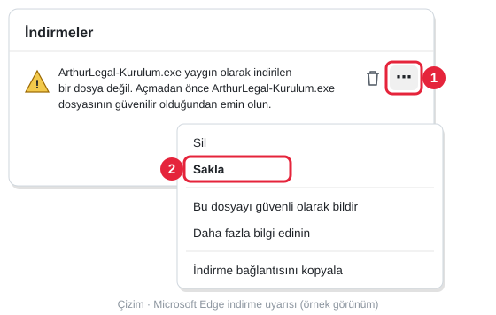
  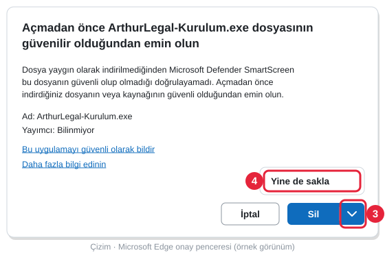

**Chrome** "**Şüpheli indirme işlemi engellendi**" derse: sağ üstteki indirme simgesine, sonra dosyanın satırına
tıklayın ve **Şüpheli dosyayı indir**'i seçin. **Geçmişten sil** dosyayı atar.

**2. Çift tıklayın.** İndirilen **ArthurLegal-Kurulum** dosyasını açın; Edge'de dosya adının altındaki
**Dosya aç**'a da tıklayabilirsiniz. Mavi bir pencerede "**Windows kişisel bilgisayarınızı korudu**" yazarsa
korkmayın, kod imzası taşımayan her yeni programda çıkar. Fareyle önce **Ek bilgi** yazısına, sonra beliren
**Yine de çalıştır** düğmesine tıklayın. <kbd>Enter</kbd>'a basmayın: Enter **Çalıştırma**'yı seçer, kurulum açılmaz.

  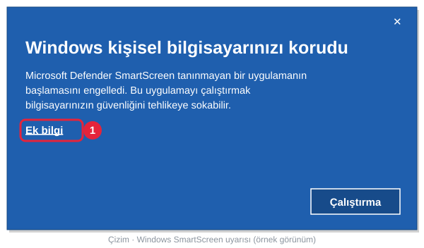
  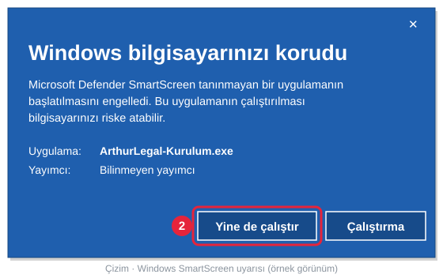

**3. Modülleri seçin.** Kurulum önce dili sorar: **Türkçe**'yi seçip **Tamam**'a (OK) tıklayın.
**Anlaşmayı kabul ediyorum**'u seçip **Sonraki**'ye tıklayın. **Modülleri seçin** ekranında kurmak
istediklerinizi işaretleyin; her birinin altında ne işe yaradığı yazar ve ilk kurulumda hiçbir kutu işaretli
gelmez. En az bir paket gerekir:

| Modül | Kimin için |
|---|---|
| **Hukuk Bürosu** | Avukatlar ve hukuk büroları |
| **Kurumsal Asistan** | Şirket hukuk birimleri |
| **Courthouse** | Hâkim ve kalem ([Courthouse sayfası](ArthurLegal-Courthouse-v1.2.0-Public-Release/)) |
| **Akademisyen** | Hukuk akademisyenleri |
| **ArthurLegal Tapu** | Ada/parsel ya da yer adıyla canlı parsel bilgisi, kroki ve harç |
| **Arthur Mask** | Belgeleri Claude'a vermeden önce bilgisayarda maskeler (yaklaşık 1 GB indirilir) |

  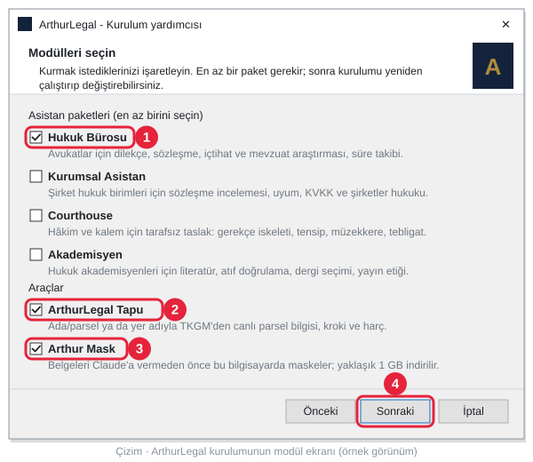

**4. Kurun.** **Sonraki**'ye, sonra **Kur**'a tıklayın. Claude Desktop açıksa kurulum onu kapatır; başlamadan
önce yazdığınız mesajı gönderin. Arthur Mask'i seçtiyseniz kurulum onu da indirir (yaklaşık 1 GB, birkaç dakika);
beklemek istemezseniz **İndirmeyi durdur**'a basıp çıkan iki soruya **Evet** deyin, Arthur Mask sonra arka
planda kendiliğinden iner. Son sayfada **Bitti**'ye tıklayın: başlangıç rehberi ve Claude Desktop açılır.
Masaüstüne seçtiğiniz modüllerin simgeleri gelir: Hukuk Bürosu ya da Kurumsal için **ArthurLegal**, ayrıca
**ArthurLegal - Courthouse**, **ArthurLegal - Akademisyen**, **ArthurLegal - Tapu** ve **Arthur Mask**. Claude
Desktop'ta yeni bir sohbet açıp sorunuzu yazın. Claude bir aracı ilk kez kullanırken izin sorarsa
**Always allow**'u (Her zaman izin ver) seçin; Claude Desktop'un menüleri İngilizcedir. Claude Desktop kurulu
değilse kurulum onu da kurmayı dener; açılmazsa [claude.ai/download](https://claude.ai/download) adresinden kurun.
Modül eklemek ya da çıkarmak için kurulum dosyasını yeniden çalıştırın; son seçiminiz işaretli gelir.

<b>Bu uyarılar neden çıkıyor, dosya güvenli mi?</b>

Windows ve tarayıcılar, az indirilmiş ve kod imzası taşımayan her programı tanımadıkları için uyarır. ArthurLegal
kurulum dosyası henüz ücretli bir kod imzalama sertifikasıyla imzalanmadı; yayımcının "bilinmeyen" görünmesi
bundandır, dosyanın zararlı olduğu anlamına gelmez. Yine de yalnız bu sayfadaki düğmeden ya da
[yayın sayfasından](https://github.com/beerbottle90/ArthurLegal/releases/latest) indirdiğiniz dosya için
devam edin; e-postayla ya da başka bir siteden gelen kopyayı açmayın. Kurulumdan sonraki güncellemeler
ayrıca dijital imzayla doğrulanır: imza tutmazsa hiçbir şey kurulmaz.

İnternet bağlantısı yokken mavi pencere "**SmartScreen'e şu anda ulaşılamıyor**" der; orada **Çalıştır**'a
tıklayın. Kurumun yönettiği bir bilgisayarda **Sakla** ya da **Yine de sakla** soluk görünüyorsa ("Kuruluşunuz
tarafından yönetilir") kurulum için bilgi işlem sorumlunuza başvurun.

<b>"Yine de çalıştır" hiç çıkmıyor ya da "Uygulama Denetimi" engeli var (Windows 11)</b>

Bilgisayarınızda Windows 11'in **Akıllı Uygulama Denetimi** açık. Bu denetim imzasız kurulum dosyalarına hiç
izin vermez, tek bir uygulamaya izin verme yolu da yoktur. Denetimi kapatmanız gerekmez; aynı kurulumun zip
yolunu kullanın:

1. **[ArthurLegal-Kurulum.zip](https://github.com/beerbottle90/ArthurLegal/releases/latest/download/ArthurLegal-Kurulum.zip)**
   dosyasını indirin (bu bağlantı da her zaman en son sürümü verir).
2. Ayıklamadan önce zip dosyasına sağ tıklayıp **Özellikler**'i açın. **Genel** sekmesinin altında "Bu dosya
   başka bir bilgisayardan geldi…" yazıyorsa yanındaki **Engellemeyi Kaldır** kutusunu işaretleyip **Tamam**'a
   tıklayın. Bu adım atlanırsa Windows, zipten çıkan kurulum dosyasını da engeller.
3. Zip dosyasına sağ tıklayın, **Tümünü Ayıkla...**'yı, sonra **Ayıkla**'yı seçin. Zip'i açıp içindeki dosyaya
   doğrudan çift tıklamayın; Windows sorarsa **Tümünü Ayıkla**'yı seçin.
4. Açılan klasörde **KUR** dosyasına (türü: Windows Komut Dosyası) çift tıklayın. Siyah pencere önce modülleri
   sorar: kurmak istediklerinizin numaralarını virgülle yazıp <kbd>Enter</kbd>'a basın (ör. Hukuk Bürosu ve Tapu
   için `1,5`). Sizden bir tuşa basmanızı isteyince kurulum bitmiştir.

Bu yolla Arthur Mask kurulmaz (belge maskeleme ve UYAP bağlantısı çalışmaz); ArthurLegal paketleri, araştırma
araçları ve Tapu çalışır.

<h3 id="mac">Mac'te kurulum</h3>

  

Düğme açılmazsa bu bağlantıya tıklayın: **[ArthurLegal-Kurulum.pkg](https://github.com/beerbottle90/ArthurLegal/releases/latest/download/ArthurLegal-Kurulum.pkg)**. macOS 11 ve sonrası, Apple
Silicon (M1 ve sonrası) ve Intel Mac'ler için tek dosya; yönetici şifresi istemez. Paketler, modüller ve
güncellemeler Windows'takiyle aynıdır; bu dosyayı da yeniden indirmeniz gerekmez.

**1. İndirin.** Yukarıdaki düğmeye tıklayın. Dosya İndirilenler klasörüne iner.

**2. Açın.** **ArthurLegal-Kurulum.pkg** dosyasına çift tıklayın. Kurulum dosyası henüz Apple'ın noter onayını
(notarization) taşımadığı için macOS ilk açılışta "**“ArthurLegal-Kurulum.pkg” Açılmadı**" der. **Bitti**'ye
tıklayın; **Çöp Sepeti’ne Taşı**'ya değil. Sonra:

1. **Sistem Ayarları**'nı açın (sol üstteki Apple menüsü → **Sistem Ayarları**) ve soldaki listeden
   **Gizlilik ve Güvenlik**'i seçin.
2. Sayfayı aşağı kaydırın. ArthurLegal-Kurulum.pkg'nin engellendiğini söyleyen satırın yanındaki **Yine de Aç**'a
   tıklayın ve Mac'inizin parolasını girin (ya da Touch ID).
3. Çıkan pencerede yine **Yine de Aç**'a tıklayın. Bu izni yalnız ilk açılışta bir kez verirsiniz.

  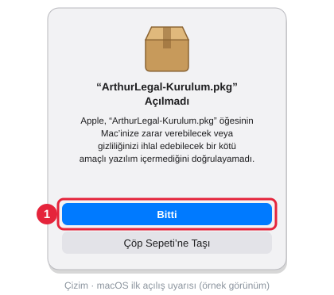
  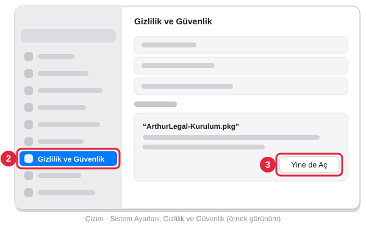

**3. Modülleri seçin.** Kurulum Mac'inizin dilinde açılır. **Sürdür**'e tıklayarak ilerleyin; lisans sayfasından
sonra çıkan pencerede **Kabul Ediyorum**'u seçin. **Yükleme Türü** ekranında kurmak istediğiniz modülleri
işaretleyin: bir modülün adına tıklayınca ne işe yaradığı altta yazar. Modüller Windows'takilerle aynıdır
(yukarıdaki tablo); ilk kurulumda hiçbiri işaretli gelmez, en az bir paket gerekir. Arthur Mask yalnız Apple
Silicon ve macOS 14 (Sonoma) ya da sonrasında seçilebilir.

  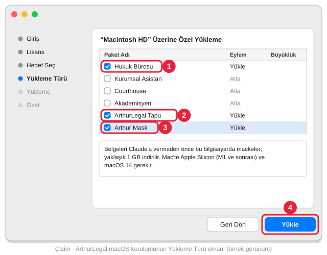

**4. Kurun.** **Yükle**'ye, son sayfada **Kapat**'a tıklayın: başlangıç rehberi tarayıcıda açılır. Seçtiğiniz
modüllerin simgeleri Uygulamalar klasöründe (Launchpad'de) ve masaüstündedir: Hukuk Bürosu ya da Kurumsal için
**ArthurLegal**, ayrıca **ArthurLegal Courthouse**, **ArthurLegal Akademisyen** ve **ArthurLegal Tapu**. Arthur
Mask'i seçtiyseniz kurulumdan sonra arka planda iner (yaklaşık 1,2 GB); hazır olunca bildirim gelir ve masaüstüne
**Arthur Mask** simgesi eklenir. Claude Desktop açıksa **Cmd+Q** ile tamamen çıkıp yeniden açın; sonra yeni bir
sohbet açıp sorunuzu yazın. Claude bir aracı ilk kez kullanırken izin sorarsa **Always allow**'u seçin. Claude
Desktop kurulu değilse [claude.ai/download](https://claude.ai/download) adresinden kurun. Modül eklemek ya da
çıkarmak için kurulum dosyasını yeniden açın; son seçiminiz işaretli gelir. Kaldırmak için: Uygulamalar →
ArthurLegal → **ArthurLegal'i Kaldır**.

Bu bölümü paylaşmak için bağlantı: **https://github.com/beerbottle90/ArthurLegal#indir** (Mac:
**https://github.com/beerbottle90/ArthurLegal#mac**)

<h2 id="download">English: download and installation</h2>

**[⬇ Download the Windows installer (ArthurLegal-Kurulum.exe)](https://github.com/beerbottle90/ArthurLegal/releases/latest/download/ArthurLegal-Kurulum.exe)**
· **[⬇ Download the Mac installer (ArthurLegal-Kurulum.pkg)](https://github.com/beerbottle90/ArthurLegal/releases/latest/download/ArthurLegal-Kurulum.pkg)** ([Mac steps](#mac-en)).
The links always download the latest release. One installer lets you choose the packages (Law Firm, Corporate
Assistant, Courthouse, Academician) and the tools (the Turkish land registry, Arthur Mask) you need and puts them
into Claude Desktop with the research connector; after that, ArthurLegal installs new versions itself in the
background and verifies their signatures, so you never need to download this file again. No administrator
rights are needed.

**1. Download.** Click the button above. The file goes to your browser's downloads list at the top right; if
the list closes, press <kbd>Ctrl</kbd> + <kbd>J</kbd>.

If **Edge** says "**ArthurLegal-Kurulum.exe isn't commonly downloaded**", the file has not been deleted; it is
waiting for your approval. Do not click the bin icon on the row:

1. Hover over the row, click the **⋯** button that appears on the right, then **Keep**.
2. In the window that opens, do not click the blue **Delete** button; click the small arrow (**˅**) right next to
   it and choose **Keep anyway**. In older Edge versions you click **Show more** first in this window.

  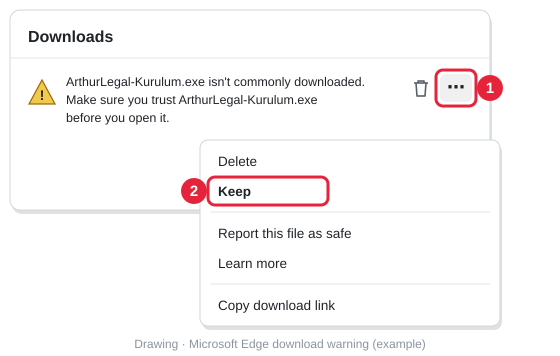
  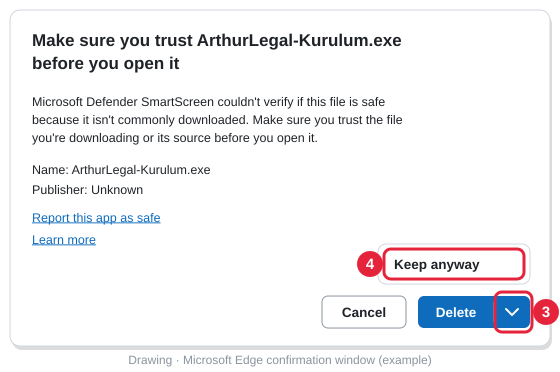

If **Chrome** says "**Suspicious download blocked**": click the downloads icon at the top right, then the file's
row, and choose **Download suspicious file**. **Delete from history** discards the file.

**2. Double-click.** Open the downloaded **ArthurLegal-Kurulum** file; in Edge you can also click **Open file**
under its name. If a blue window says "**Windows protected your PC**", don't worry: it appears for every new
program without a code signature. With the mouse, click **More info**, then the **Run anyway** button that
appears. Do not press <kbd>Enter</kbd>: Enter selects **Don't run** and setup does not open.

  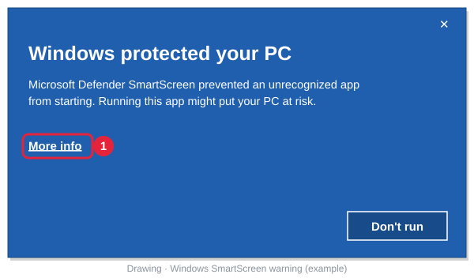
  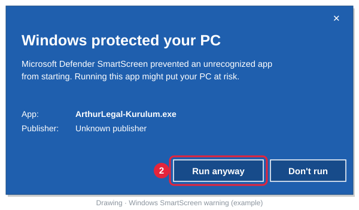

**3. Choose modules.** Setup first asks for a language: choose **English** and click **OK**. Select **I accept the
agreement** and click **Next**. On the **Choose modules** screen, tick what you want to install; each module has a
short description under it, and nothing is ticked on a first installation. At least one package is needed:

| Module | For |
|---|---|
| **Law Firm** | Lawyers and law firms |
| **Corporate Assistant** | In-house legal teams |
| **Courthouse** | Judges and court clerks (Turkish procedure; [Courthouse page](ArthurLegal-Courthouse-v1.2.0-Public-Release/), in Turkish) |
| **Academician** | Legal academics |
| **ArthurLegal Tapu** | Live Turkish land-registry parcels by block/parcel or place name, with sketch and fees |
| **Arthur Mask** | Masks documents on this computer before Claude sees them (about 1 GB download) |

  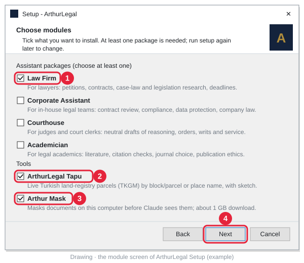

**4. Install.** Click **Next**, then **Install**. If Claude Desktop is open, setup closes it, so send any message
you are typing first. If you chose Arthur Mask, setup also downloads it (about 1 GB, a few minutes); if you don't
want to wait, click **Stop download** and answer **Yes** to both questions, and Arthur Mask downloads later in the
background. On the last page click **Finish**: the start guide and Claude Desktop open. The desktop gets an icon
for each module you chose: **ArthurLegal** for Law Firm or Corporate, plus **ArthurLegal - Courthouse**,
**ArthurLegal - Academician**, **ArthurLegal - Tapu** and **Arthur Mask**. Open a new chat in Claude Desktop and
type your question. When Claude asks for permission the first time it uses a tool, choose **Always allow**.
If Claude Desktop is not installed, setup tries to install it; if it does not open, get it from
[claude.ai/download](https://claude.ai/download). To add or remove modules, run the installer again; your last
choice comes pre-ticked.

<b>Why do these warnings appear? Is the file safe?</b>

Windows and browsers warn about any program that is rarely downloaded and carries no code signature. The
ArthurLegal installer is not yet signed with a paid code-signing certificate; that is why the publisher shows as
unknown, not because the file is harmful. Still, continue only with a file you downloaded from the button on this
page or from the [release page](https://github.com/beerbottle90/ArthurLegal/releases/latest); do not open a copy
that came by e-mail or from another site. Updates after setup are also verified with a digital signature: if the
signature does not match, nothing is installed.

Without an internet connection the blue window says "**SmartScreen can't be reached right now**"; click **Run**
there. On a computer managed by an organisation, if **Keep** or **Keep anyway** is greyed out ("Managed by your
organization"), ask your IT team to install it.

<b>No "Run anyway" button, or an "App Control" block (Windows 11)</b>

Windows 11 **Smart App Control** is on. It never allows unsigned installers and has no way to allow a single app.
You do not need to turn it off; use the zip version of the same setup:

1. Download **[ArthurLegal-Kurulum.zip](https://github.com/beerbottle90/ArthurLegal/releases/latest/download/ArthurLegal-Kurulum.zip)**
   (this link also always gives the latest release).
2. Before extracting, right-click the zip file and open **Properties**. If the **General** tab says "This file
   came from another computer…", tick **Unblock** next to it and click **OK**. If you skip this step, Windows
   also blocks the setup file that comes out of the zip.
3. Right-click the zip file, choose **Extract All...**, then **Extract**. Do not open the zip and double-click the
   file inside it; if Windows asks, choose **Extract all**.
4. In the folder that opens, double-click **KUR** (type: Windows Command Script). The black window first asks
   for the modules: type the numbers of the ones you want, separated by commas, and press <kbd>Enter</kbd>
   (e.g. `1,5` for Law Firm and Tapu). When it asks you to press a key, setup has finished.

Arthur Mask is not installed this way (document masking and the UYAP bridge do not work); the ArthurLegal
packages, the research tools and Tapu work.

<h3 id="mac-en">Installing on a Mac</h3>

**[⬇ ArthurLegal-Kurulum.pkg](https://github.com/beerbottle90/ArthurLegal/releases/latest/download/ArthurLegal-Kurulum.pkg)**: one file for Apple Silicon (M1 or later) and Intel Macs with macOS 11 or
later; no administrator password. The packages, modules and updates are the same as on Windows, and you never need
to download this file again either.

**1. Download.** Click the link above. The file goes to your Downloads folder.

**2. Open.** Double-click **ArthurLegal-Kurulum.pkg**. The installer is not yet notarised by Apple, so the first
time macOS says "**“ArthurLegal-Kurulum.pkg” Not Opened**". Click **Done**, not **Move to Trash**. Then:

1. Open **System Settings** (Apple menu at the top left → **System Settings**) and choose **Privacy & Security**
   in the list on the left.
2. Scroll down. Next to the line saying that ArthurLegal-Kurulum.pkg was blocked, click **Open Anyway** and enter
   your Mac's password (or use Touch ID).
3. In the window that appears, click **Open Anyway** again. You allow it once, the first time only.

  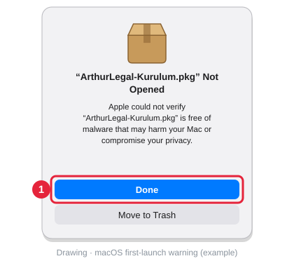
  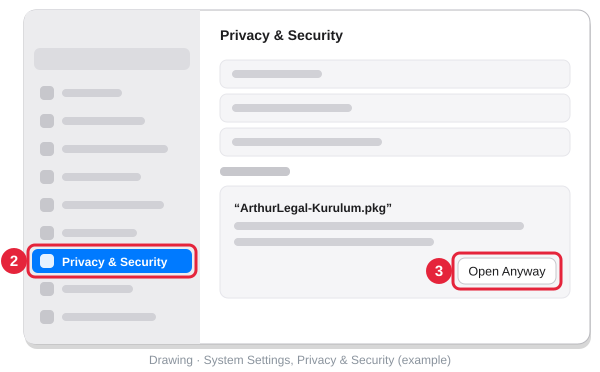

**3. Choose modules.** Setup opens in your Mac's language. Click **Continue** to move on, and **Agree** in the
window that follows the licence page. On the **Installation Type** screen, tick the modules you want; click a
module's name to see what it does below the list. The modules are the same as on Windows (table above); nothing is
ticked on a first installation and at least one package is needed. Arthur Mask can be chosen on Apple Silicon with
macOS 14 (Sonoma) or later only.

  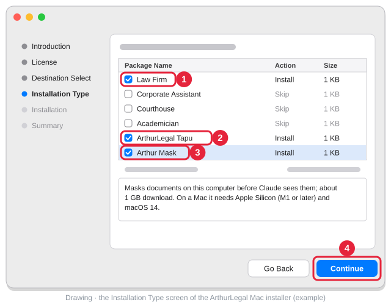

**4. Install.** Click **Install**, then **Close** on the last page: the start guide opens in your browser. The
modules you chose have icons in the Applications folder (Launchpad) and on the desktop: **ArthurLegal** for Law
Firm or Corporate, plus **ArthurLegal Courthouse**, **ArthurLegal Academician** and **ArthurLegal Tapu**. If you
chose Arthur Mask, it downloads in the background after setup (about 1.2 GB); a notification says when it is
ready and an **Arthur Mask** icon appears on the desktop. If Claude Desktop is open, quit it completely with
**Cmd+Q** and open it again; then open a new chat and type your question. When Claude asks for permission the
first time it uses a tool, choose **Always allow**. If Claude Desktop is not installed, get it from
[claude.ai/download](https://claude.ai/download). To add or remove modules, open the installer again; your last
choice comes pre-ticked. To uninstall: Applications → ArthurLegal → **Uninstall ArthurLegal**.

Link to share this section: **https://github.com/beerbottle90/ArthurLegal#download** (Mac:
**https://github.com/beerbottle90/ArthurLegal#mac-en**)

---

> **Proprietary — Non-Commercial Use Only. All Rights Reserved. See [LICENSE](LICENSE).**

**Multi-jurisdiction legal AI assistant packages that run on [Claude.ai Projects](https://claude.ai/projects).**
Each package is a `SYSTEM_PROMPT.md` (Custom Instructions) plus a `knowledge/`
folder, and reaches **28 jurisdictions** through **one primary MCP connector** (Türkiye plus fourteen
jurisdictions and the Turkish land registry, no auth), up to four optional ones, and a curated primary-source reference layer.

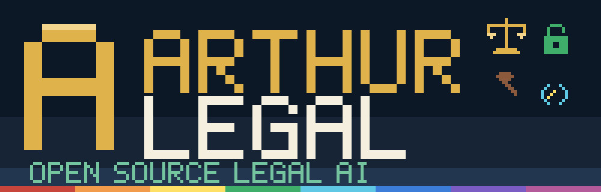

> ### ⬇ Arthur Mask — local privacy gate for Claude Desktop (Windows and macOS)
> **[Download for Windows: ArthurMask-Kurulum.exe](https://github.com/beerbottle90/ArthurLegal/releases/download/arthur-mask/ArthurMask-Kurulum.exe)** (about 1 GB) · **[Download for macOS: ArthurMask-Kurulum.dmg](https://github.com/beerbottle90/ArthurLegal/releases/download/arthur-mask/ArthurMask-Kurulum.dmg)** (Apple Silicon, macOS 14+, about 1.2 GB). The links download directly; no GitHub account needed.
> Windows: double-click the downloaded file. macOS: open the DMG, drag Arthur Mask to Applications, then allow it once under System Settings → Privacy & Security → Open Anyway. The ArthurLegal installers (Windows and Mac) can also install it for you: tick Arthur Mask on their module screen. Use it for any document that names a client, party, witness or employee; plain legal research questions do not need it. Guide: `ARTHUR-MASK.md` in the Law Firm, Corporate or Courthouse package.
> **Türkçe:** [Windows kurulum dosyası](https://github.com/beerbottle90/ArthurLegal/releases/download/arthur-mask/ArthurMask-Kurulum.exe): inen dosyaya çift tıklayın. [macOS disk görüntüsü](https://github.com/beerbottle90/ArthurLegal/releases/download/arthur-mask/ArthurMask-Kurulum.dmg): Arthur Mask'i Uygulamalar'a sürükleyin, ilk açılışta Gizlilik ve Güvenlik → Yine de Aç ile onaylayın; anlatım paketlerdeki `ARTHUR-MASK.md` dosyasında.

Built for legal teams that work across borders: a contract governed by English
law, arbitrated in Geneva, with an Azerbaijani counterparty and an EU data-transfer
question is one workflow, not four.

## Packages — current versions

| Profile | Current version | For | Scope |
|---|---|---|---|
| **Corporate Assistant** | **[v1.10.1](ArthurLegal-CorporateAssistant-v1.10.1-Public-Release/)** | In-house legal teams | 12 practice areas · 28 jurisdictions · one primary MCP connector (Türkiye + 14 jurisdictions + land registry) · 104 knowledge files · Arthur Mask local privacy gate |
| **Law Firm Assistant** | **[v1.10.1](ArthurLegal-Law-Firm-v1.10.1-Public-Release/)** | Law firms, 0–30 staff | 16 practice areas · 28 jurisdictions · one primary MCP connector (Türkiye + 14 jurisdictions + land registry) · 129 knowledge files · Arthur Mask local privacy gate |
| Academician | [v1.1.1](ArthurLegal-Academician-v1.1.1-Public-Release/) | Legal academics | Publication strategy, journal selection, associate-professorship track, ethics board · installer module (Windows, macOS) |
| **Courthouse** | **[v1.2.0](ArthurLegal-Courthouse-v1.2.0-Public-Release/)** | Judges and court clerks | 12 plugins, 56 skills · 10 court-type profiles · 7 reminder watchers · neutral drafts for the judge or panel to approve · installer module (Windows, macOS) · Arthur Mask local privacy gate |

The two flagship packages (Corporate, Law Firm) are multi-jurisdictional. The
Academician and Courthouse packages are built around Turkish academic-promotion
and Turkish judicial procedure respectively, and are jurisdiction-specific by
design.

Only the current version of each package sits at the top of the repository; earlier versions are kept in
[`arsiv/`](arsiv/) (`v1.0.0` … `v1.10.0`, Law Firm `v1.8.1`; Courthouse `v1.0.0` … `v1.1.1`; Academician `v1.0.0` … `v1.1.0`).
To install on Windows or a Mac, use the [download section](#indir) at the top of this page: all four packages are
modules of the same installer. Otherwise start from the `KURULUM.md` file in the package you want (Turkish); the
Law Firm and Academician packages also include an English `INSTALLATION.md`. Arthur Mask, the optional privacy gate, is installed by ArthurLegal Setup or from the download box above.

## Use ArthurLegal MCP directly

The research connector behind every package is a public, hosted endpoint. You can use it
without installing a package, in any MCP client (Streamable HTTP, no authentication):

    https://arthurlegal-mcp.fly.dev/mcp

| Client | How |
|---|---|
| Claude (claude.ai / Claude Desktop) | Settings → Connectors → Add custom connector, URL `https://arthurlegal-mcp.fly.dev/mcp` |
| Claude Code | `claude mcp add --transport http arthurlegal https://arthurlegal-mcp.fly.dev/mcp` |
| Cursor, VS Code and other JSON-configured clients | `{"mcpServers": {"arthurlegal": {"url": "https://arthurlegal-mcp.fly.dev/mcp"}}}` |
| Clients that only launch local (stdio) servers | command `npx -y mcp-remote https://arthurlegal-mcp.fly.dev/mcp` |

Call the `status` tool first to see which jurisdictions are loaded. The land-registry tools (`tkgm_`) fetch single parcels live from TKGM Parsel Sorgu, at most 30 requests a minute for all users together; the first live call in a chat returns a one-time consent card ([design](https://github.com/beerbottle90/arthurlegal-mcp/blob/master/tkgm-mcp/docs/MANIFESTO.md)). The endpoint searches public
sources; do not put client names or confidential facts into queries. Setup details and source:
[github.com/beerbottle90/arthurlegal-mcp](https://github.com/beerbottle90/arthurlegal-mcp#use-it-directly).
Each package's `KURULUM.md` / `INSTALLATION.md` repeats these steps next to the connector step.

## UYAP bridge — distributed separately

For lawyers who follow their own case files in UYAP, ArthurLegal has a read-only bridge to the lawyer's **own**
UYAP session. It is not part of the packages or of the public installer: it is distributed separately, and a firm
reviews the UYAP Lawyer Portal terms of use in writing before switching it on. When it is installed together with
Arthur Mask, ArthurLegal Setup adds one desktop icon for it: **"ArthurLegal - UYAP Dashboard"** (Setup 2.4.0).

- **Sign-in.** If UYAP is not connected, the Dashboard opens the UYAP Lawyer Portal (`avukat.uyap.gov.tr`) in a
  separate browser profile; the lawyer signs in with e-signature or e-Devlet.
- **Scan on click only.** UYAP is asked only when the lawyer presses Scan. There are no scheduled queries, and a rate
  limit protects the portal.
- **Deadlines, entered twice.** The lawyer calculates and types the last day first; the bridge's own calculation runs
  only afterwards and warns only on a mismatch, which a second lawyer resolves on the same screen after a blind
  calculation. Until then the earlier day stands. No date is ever given to the model.
- **Calendar.** One click writes an all-day calendar entry with reminders three days and one day before, at 09:00;
  the file is written only on the lawyer's computer.
- **Privacy.** Real values, case numbers included, are masked before anything reaches Claude. The real list opens only
  on the lawyer's screen and cannot be copied.
- **Firm settings.** A firm file decides whether a red-line warning can be overridden with the lawyer's approval (the
  default) or never, and whether criminal files give Claude calendar data only.

**Türkçe:** UYAP köprüsü ayrı dağıtılır; paketlerde ve genel kurulumda yoktur. Kurulduğunda masaüstünde tek simge
olur: "ArthurLegal - UYAP Dashboard". Avukatın kendi oturumunda, yalnız onun tıkıyla ve salt okunur çalışır. Son günü
önce avukat yazar; takvim kaydı avukatın bilgisayarında oluşur, modele gün gitmez. Büro, Avukat Portal Kullanım
Sözleşmesini yazılı olarak değerlendirmeden köprüyü açmaz.

## Jurisdictional coverage

Coverage is real but **not uniform in depth** — the packages state which tier a
source sits in, and the assistant flags reduced coverage in its output rather
than filling the gap with recalled text.

**28 jurisdictions** = the original 14 — 12 national (🇹🇷 TR · 🇨🇭 CH · 🇺🇸 US · 🇦🇿 AZ ·
🇬🇧 UK · 🇩🇪 DE · 🇫🇷 FR · 🇮🇹 IT · 🇯🇵 JP · 🇷🇺 RU · 🇨🇳 CN · 🇷🇸 RS) + 2 supranational legal
orders (🇪🇺 EU/CJEU · ECHR) — plus 8 added in v1.5.0 (🇦🇪 UAE · 🇨🇿 Czechia · 🇬🇪 Georgia ·
🇮🇱 Israel · Central Asia 🇰🇿 KZ + 🇺🇿 UZ · 🇷🇴 Romania · 🇺🇦 Ukraine · 🇬🇷 Greece; reference
guides in `knowledge/references/`) and 6 added in v1.6.0 (🇳🇱 NL · 🇵🇱 PL · 🇦🇹 AT · 🇮🇪 IE ·
🇫🇮 FI · 🇪🇸 ES).

| Tier | Jurisdictions | How it is reached |
|---|---|---|
| **Primary-source MCP** — verbatim norm text and case law | 🇹🇷 Türkiye · 🇨🇭 Switzerland · 🇺🇸 United States *(case law)* · 🇦🇿 Azerbaijan · 🇦🇹 Austria · 🇩🇪 Germany · 🇳🇱 Netherlands · 🇵🇱 Poland · 🇪🇸 Spain · 🇫🇮 Finland · 🇮🇪 Ireland | **[ArthurLegal MCP](https://github.com/beerbottle90/arthurlegal-mcp)** — Türkiye (`tr_`: courts, legislation with gerekçe, Official Gazette, eight regulators, semantic archive) plus fourteen jurisdictions behind one connector, 104 tools, jurisdiction-prefixed, no auth · **OpenCaseLaw.ch** (972K+ decisions, 33 tools) · **CourtListener** (Free Law Project — US federal and state case law, PACER, citation verification) · **Fedlex** (Swiss federal legislation) · **TR Legal MCP** (optional; only ECHR, KİK, Sayıştay, Reklam Kurulu, KDK, TBB, HSK) |
| **Legislation via WebFetch** — no extra connector | 🇬🇧 UK · 🇺🇸 US *(federal legislation, GovInfo)* · 🇪🇺 EU / CJEU / ECHR · 🇩🇪 Germany · 🇫🇷 France · 🇮🇹 Italy · 🇯🇵 Japan · 🇷🇺 Russia · 🇨🇳 China · 🇷🇸 Serbia | Official gazette and legislation portals |
| **Cross-cutting corpora** — precedent, doctrine, screening | 107 countries (signed contracts) · 10 open-access scholarship indexes · global sanctions / PEP | **ArthurLegal MCP** (`contracts_`, `scholar_`) · **OpenSanctions** (REST API, API key) |

Türkiye currently has the deepest coverage: inside ArthurLegal MCP under the `tr_`
prefix — courts, legislation, Official Gazette, eight regulators and a 19,498-document
semantic archive — plus the largest share of the reference layer.
Switzerland (972K+ decisions and Fedlex legislation) and Azerbaijan (official
`api.e-qanun.az` with in-force status verification) follow. Seven more European
jurisdictions are also reached through ArthurLegal MCP, whose `status` tool reports
each one's index coverage — a statute outside that range is not found, and the
search returns its nearest neighbour rather than saying so.

## v1.6.0 — Source audit: 7 broken sources fixed, 6 new jurisdictions (2026-08-30)

Every MCP and every WebFetch/REST source in the package was hit with a **real
query** — the returned data was inspected, not just the status code.

**Fixed (each verified live):**

- **EUR-Lex full text.** `eur-lex.europa.eu/legal-content/...`, `search.html` and
  `eli/...` return a JS shell, not the document — a working **CELLAR three-step
  chain** replaces them (proved on GDPR/EN and Directive 2019/944/RO).
- **German NeuRIS host.** `api.rechtsinformationen.bund.de` never existed
  (NXDOMAIN); corrected to `testphase.rechtsinformationen.bund.de`.
- **Romania.** `legislatie.just.ro` drops the connection; primary source moved to
  EUR-Lex CELLAR Romanian full text, with working fallbacks documented.
- **OpenCaseLaw.ch REST fallback.** Every `/api/*` path 404s — the fictitious
  fallback was removed.
- **EU sanctions endpoint.** `sanctionsmap.eu/api/v1/sanction` 404s; replaced with
  the EU FSF consolidated list (CSV/XML) and the working UN consolidated XML.
- **ILO NATLEX (AZ)** 403 → routed to the e-qanun MCP.
- **CourtListener `citation-lookup/`** needs a token header WebFetch cannot send →
  routed to the `analyze_citations` / `extract_citations` MCP tools.

**Added — six MCP servers**, one per jurisdiction whose official source cannot be
searched properly. All dependency-free (standard library only) and auth-free, with
hybrid retrieval — BM25 plus trigram fuzzy matching, and a dense-vector channel that
turns on when an embeddings endpoint is configured:
[nl-rechtspraak-mcp](https://github.com/beerbottle90/arthurlegal-mcp/tree/master/nl-rechtspraak-mcp) ·
[pl-sejm-mcp](https://github.com/beerbottle90/arthurlegal-mcp/tree/master/pl-sejm-mcp) ·
[at-ris-mcp](https://github.com/beerbottle90/arthurlegal-mcp/tree/master/at-ris-mcp) ·
[ie-statutebook-mcp](https://github.com/beerbottle90/arthurlegal-mcp/tree/master/ie-statutebook-mcp) ·
[fi-finlex-mcp](https://github.com/beerbottle90/arthurlegal-mcp/tree/master/fi-finlex-mcp) ·
[es-boe-mcp](https://github.com/beerbottle90/arthurlegal-mcp/tree/master/es-boe-mcp)

**Added — 6 jurisdictions, each with a live-tested API:** 🇳🇱 Netherlands (KOOP SRU
full text + 3,751,381 ECLI decisions) · 🇵🇱 Poland (Sejm ELI API with in-force
status) · 🇦🇹 Austria (RIS OGD v2.6 — legislation *and* case law) · 🇮🇪 Ireland
(section-level ELI) · 🇫🇮 Finland (Finlex Akoma Ntoso REST) · 🇪🇸 Spain (BOE).

Luxembourg was assessed and **dropped**: every Legilux URL returns the same
2,116-byte empty Angular shell, and no other route exists. HTTP 200 is not the
same as a working source.

Plus `references/MCP-ROADMAP.md` — an evidence-based ranking of which jurisdictions
justify building an MCP server, and which already have a good enough public API.

## Setup 2.6.0 — ArthurLegal on the Mac (2026-10-06)

- **A Mac installer.** `ArthurLegal-Kurulum.pkg` installs the same packages and modules as the Windows installer,
  on Apple Silicon and Intel Macs with macOS 11 or later, without an administrator password. The module screen is
  the macOS Installer's **Installation Type** step, with the same names and descriptions; running it again shows
  the last choice. Steps with drawings: [Installing on a Mac](#mac-en).
- **Icons.** Each chosen package and Tapu becomes an app in the Applications folder (Launchpad, Spotlight) with an
  alias on the desktop: **ArthurLegal**, **ArthurLegal Courthouse**, **ArthurLegal Academician**,
  **ArthurLegal Tapu**. The start guide, project folders, update check and uninstaller are in Applications →
  ArthurLegal.
- **The same updates.** Macs and Windows PCs read the same signed release; a Mac checks at login and every six
  hours.
- **Arthur Mask on the Mac.** If chosen, it downloads after setup (about 1.2 GB; Apple Silicon and macOS 14 or
  later), is checked against the signed release and registers itself with Claude Desktop; a notification says when
  it is ready.
- **Tested on a Mac at every build.** A GitHub Actions job builds the package, installs it on an Apple Silicon Mac
  with Courthouse, Tapu and Arthur Mask ticked, checks the Claude Desktop registration, the icons, the update job
  and both local servers, then uninstalls it.
- The Mac installer is not yet notarised by Apple: allow it once under System Settings → Privacy & Security →
  **Open Anyway**.

On Windows nothing changes apart from the version number. The packages stay at their current versions.

## Setup 2.5.0 — One installer, choose your modules; Courthouse 1.2.0 (2026-10-06)

- **Choose modules.** After the licence page a new screen lists six modules, each with a short description under it:
  the Law Firm, Corporate Assistant, Courthouse and Academician packages, ArthurLegal Tapu and Arthur Mask. Nothing is
  ticked on a first installation and at least one package is needed. The selection decides the desktop icons
  (**ArthurLegal** for Law Firm or Corporate, **ArthurLegal - Courthouse**, **ArthurLegal - Academician**,
  **ArthurLegal - Tapu**; Arthur Mask adds its own), the Claude Desktop registration, the packages the assistant offers
  and the ready-made project folders. A judge or court clerk who ticks Courthouse, Tapu and Arthur Mask gets exactly
  those three icons. Running the installer again shows the last choice; a module that is unticked loses its icon and
  registration, while the user's own files in its project folder stay.
- **Courthouse and Academician in Claude Desktop.** Both packages, until now set up by hand in Claude.ai Projects,
  install like Law Firm and Corporate: no project, no pasted instructions, no uploaded files. With one package the
  assistant uses it by default; with several, the instructions tell the model which package fits which task.
- **Updates keep the choice.** Installations from before 2.5.0 update silently and keep exactly what they had (Law
  Firm, Corporate, Tapu and Arthur Mask); nothing new is added to them. The updater no longer downloads Arthur Mask
  for an installation that did not choose it.
- **Silent installation.** `ArthurLegal-Kurulum.exe /VERYSILENT /MODULLER=adliye,tapu,mask` installs without
  windows; an invalid list stops setup before anything is installed. The zip route asks for the modules in its
  console window.
- **Courthouse 1.2.0** (Turkish): 12 plugins and 56 skills (appeal chamber and clerk, shared research, publication of
  decisions), 10 court-type profiles, 7 reminder watchers that work from a list the user gives, and 36 references;
  every statute article written into the package was checked against the official text. Its page now starts with
  the download button and an illustrated installation guide.

The Law Firm and Corporate packages are unchanged at **v1.10.1**; Academician stays **v1.1.1**.

## Setup 2.4.4 — The installer speaks English too; research tools are read-only (2026-10-06)

- **English and Turkish.** Setup asks for its language at start, preselecting the one that matches Windows. The
  wizard, the license page (an English or Turkish preface over the same English licence texts), the finish page,
  the start guide, the Start-menu shortcut names and the zip instructions (`README.txt`, `BENIOKU.txt`) follow
  the choice. Installations from before 2.4.4 keep their Turkish names.
- **Claude's permission button.** Claude Desktop's menus are in English, so every guide now names the real button,
  **Always allow**. The research tools reached through the local bridge are marked read-only, so Claude can offer
  a lasting permission instead of asking again in each chat.
- **No "Not Found" while a release is published.** A new release is opened as a draft, every file is uploaded,
  and only then is it published and marked Latest; a file replaced in an existing release is uploaded under a
  temporary name first. Publishing to this repository refuses an installer that is not from the current build
  or that contains the UYAP bridge.
- **Smart App Control.** On a Windows 11 computer with Smart App Control on, the updater no longer downloads the
  1 GB Arthur Mask installer that Windows would block anyway. The zip instructions now say to unblock the zip
  before extracting it: Smart App Control blocks an internet `.cmd` file, and File Explorer carries that mark onto
  the extracted files.

The packages are unchanged: Law Firm and Corporate **v1.10.1**.

## Setup 2.4.3 — A spare signing key kept offline (2026-09-29)

Installations now trust two update-signing keys: the everyday release key and a spare kept offline. The list
travels inside the signed update package, so if the everyday key is ever lost, updates are signed with the spare
and still reach every installation from 2.4.3 on without a reinstall; a key change spreads the same way. 2.4.2
installations move to 2.4.3 silently. The packages are unchanged: Law Firm and Corporate **v1.10.1**.

## Setup 2.4.2 — New update-signing key (2026-09-29)

The Windows installer signs its silent updates with a new key. Installations older than 2.4.2 do not accept
updates signed with it: they install nothing and show `manifest imzası geçersiz` in their update status. Run
`ArthurLegal-Kurulum.exe` once to install over them; later updates arrive silently again. The installer bundles
Tapu 0.5.2 (province, district and neighbourhood from lists; block and parcel in separate boxes). The packages are
unchanged: Law Firm and Corporate **v1.10.1**.

## v1.10.1 — A plain warning when live data cannot be retrieved (2026-09-27)

Law Firm and Corporate **v1.10.1**, Courthouse **v1.1.1**, Academician **v1.1.1**, ArthurLegal Setup **2.4.1** (bundles the
new packages).

- **One visible warning instead of bracket tags.** When a legal fact is not retrieved in the current chat through the
  path the rules name for it (the tool is not installed, did not answer, failed, was cancelled or not approved, or the
  fact came from memory or from a path outside the rules, such as a general web search), the answer now says so in
  plain words, exactly: `UYARI: veri çekilemedi, teyidiniz gerekli: <link>` ("warning: the data could not be
  retrieved; your verification is needed"). Bracket tags such as `[model bilgisi — doğrulayın]`, `[doğrulayın]` and
  `[UYAP/Lexpera — manuel doğrulayın]` are gone from the Turkish knowledge files. The English skills keep their
  `[verify]` family of tags internally; the system prompt turns each of them into the same warning in the answer.
- **The link is real.** It is the address the tool returned for that document, or the official entry page listed in
  the system prompt (mevzuat.gov.tr, the Court of Cassation and Council of State decision search, the Constitutional
  Court databases, Resmî Gazete, the regulators, UYAP, TKGM Parsel Sorgu, EUR-Lex, HUDOC, legislation.gov.uk,
  CourtListener, GovInfo, Fedlex); for other countries, the official address in that country's guide. Deep links are
  never guessed.
- **Unchanged:** information that carries the warning still never enters the body of a contract, petition or file
  before it is verified. The article verification gate now writes the warning with the mevzuat.gov.tr link.

## Setup 2.4.0 — One UYAP icon: the UYAP Dashboard (2026-09-27)

- **One icon for UYAP.** When the separately distributed UYAP bridge and Arthur Mask are both installed, the
  installer adds a single UYAP shortcut to the desktop and the Start menu: "ArthurLegal - UYAP Dashboard" (the
  bridge's local screen, formerly "UYAP Ekranı"). The separate "UYAP Tarayıcısı" Start menu shortcut is gone:
  the Dashboard opens the separate-profile login browser itself. Shortcuts left over from earlier versions are
  removed on reinstall.
- **Short name.** In a firm-specific build the brand file may give a short name for this icon
  (`tema.json` → `kisa_ad`): "<short name> - UYAP Dashboard". The other shortcuts keep the product name. Unsafe
  names fall back to ArthurLegal. Uninstall removes only "<short name> - UYAP…" shortcuts, nothing else that
  starts with the short name.
- **Version in every name.** Shortcut names end with the installed version ("ArthurLegal 2.4.0",
  "ArthurLegal - Tapu 2.4.0", "ArthurLegal - UYAP Dashboard 2.4.0"); so do the start page title and the Windows
  programs list entry. The number always comes from the running code's `surum.txt`.
- **Honest updates.** After a silent or manual update, the updater rewrites the shortcuts and the programs list
  entry only once the new package has been verified and made active, using the new version's code; if the update
  did not happen, names keep the old number and the start page shows why. A shortcut left with another number
  (for example after an interrupted update) is corrected at the next check. The start page also shows the last
  verified update ("2.3.0 → 2.4.0") and the version Claude Desktop is actually running, with a note to restart
  Claude Desktop when it is still on the old one.
  Packages are unchanged; no new public release.

## Setup 2.3.0 — A firm's own product name (2026-09-27)

- **Product name.** In a firm-specific build, when the firm's brand folder names a product
  (`firma/<code>/marka/tema.json` → `urun`), the shortcuts, the Start menu folder, the start page and the
  Windows programs list carry that name instead of ArthurLegal. The install folder and the Claude Desktop server
  names do not change. Unsafe names (path characters, device names, over 60 characters) fall back to ArthurLegal.
- **Icon cache.** The firm icon reaches the shortcuts through a file named after its content hash
  (`bin/buro-<hash>.ico`): Windows caches icons by path, and a new icon under an old path keeps showing the old
  picture. When the product name changes, shortcuts left over under the previous name are removed.
- **Reinstall over an existing install.** Shortcuts were written by the previously active version's code and
  the Start menu folder kept its previous name; the installer now uses the newest version and the product name.

## Setup 2.2.0 — A desktop shortcut for the UYAP screen (2026-09-26)

- **UYAP screen shortcut.** When the separately distributed UYAP bridge includes its local screen (`uyap/ekran.py`)
  and Arthur Mask is installed, the installer adds an "ArthurLegal - UYAP Ekranı" shortcut to the desktop and the
  Start menu. The screen runs in Arthur Mask's Python with the same environment as the Claude Desktop registration
  (offline model, no user site-packages). Shortcuts are written at install time; silent updates do not add them.
  Packages are unchanged; no new public release.

## Setup 2.1.1 — A firm's own icon (2026-09-26)

- **Firm icon.** A firm-specific build (`derle.py --firma <code>`) takes `firma/<code>/marka/simge.ico` when present: the
  installer, the shortcuts and the uninstall entry carry the firm's icon instead of ArthurLegal's. Silent updates do not touch
  it. Packages are unchanged; no new public release.

## v1.10.0 — The Turkish land registry answers in the chat; the tool map matches the live endpoint (2026-09-23)

Law Firm and Corporate **v1.10.0**, Courthouse **v1.1.0**, Academician **v1.1.0**, ArthurLegal Setup **2.1.0**.

- **Land registry, live.** ArthurLegal MCP now carries the Turkish land-registry tools (`tkgm_`, 17 tools). Say a place, a
  coordinate, or a province, district and neighbourhood with block and parcel ("Kadıköy Caferağa 123 ada 45 parsel"); the
  parcel comes live from TKGM Parsel Sorgu's public data with a parcel report, a scaled sketch, a map and the statute
  addresses for the dispute at hand. There is no file download step any more. The connector keeps one queue for all users:
  one request in flight, at most 30 a minute, backs off when TKGM slows down, stops on 429/503/403, caches a parcel for a
  day, refuses bulk scans, and names itself in every request. The first live call in a chat shows a one-time consent card.
  Design: [MANIFESTO.md](https://github.com/beerbottle90/arthurlegal-mcp/blob/master/tkgm-mcp/docs/MANIFESTO.md). The data is informational: no owner, annotation or mortgage data.
- **Türkiye backend 0.5.0, renamed.** The Turkish backend is now `arthur-tr-hukuk-mcp` (formerly ArthurLegalTR; the old
  name was too close to this repository's). The single-call article read
  (`tr_mevzuat_madde_getir(number="6769", madde_no="120")`) the v1.9.1 packages rely on is live.
- **Every tool reference checked against the live schema.** 121 tools, 16 backends. Two example calls were wrong: a GİB
  search passed `phrase`, which does not exist, so the search text never reached GİB and results came back unfiltered; an
  EPDK example passed `category` outside `params`. Both corrected.
- **ArthurLegal Setup 2.1.0** installs the new packages and the local ArthurLegal Tapu 0.5.0 (same live parcel tools,
  unprefixed in Claude Desktop), and updates existing installations silently.

See each package's CHANGELOG.

## v1.9.1 — Article verification gate; wrong article citations in the knowledge files corrected (2026-09-22)

Law Firm and Corporate **v1.9.1**, Courthouse **v1.0.5**, Academician **v1.0.3**. A drafted protocol cited SMK m. 120 as the
company's pre-emption right; m. 120 is the employee's pre-emption right on the employer's bankruptcy. Every statute article
that appears in a deliverable, including inside contract and petition bodies, must now be fetched in the conversation and its
heading matched against what the text says it provides; an article that cannot be fetched is not written into the body.
Knowledge files were checked against the official current text and 301 verified wrong citations were corrected. See each
package's CHANGELOG.

## v1.9.0 — Topic triage that runs inside the server, and two filters that silently did nothing (2026-09-20)

Law Firm and Corporate **v1.9.0**, Courthouse **v1.0.4**, Academician **v1.0.2**. The Türkiye backend is now ArthurLegalTR 0.4.0;
the connector address is unchanged. After connecting, `status` must report `backend_status.tr.version` 0.4.0 or later.

**A question that could not be asked.** Gazette and legislation titles rarely name their subject: in a labelled corpus the topic
word appears in 10% of enforcement items and 14% of competition items. `tr_resmi_gazete_tara`, `tr_resmi_gazete_fihrist` and
`tr_mevzuat_ara` now take a `konu` filter (`enerji`, `rekabet`, `vergi`, `icra`): a small model that runs inside the server, makes
no network call and sends the query to no third party, trained only on the public Official Gazette index. For omnibus laws
("Bazı Kanunlarda Değişiklik Yapılmasına Dair Kanun") it reads the names of the amended laws — Law 7531 is found through the
Enforcement and Bankruptcy Code — and an omnibus law whose names cannot be read is never dropped.

**Measured, and the numbers travel with the tool.** Gazette out-of-fold sensitivity 92–100% per topic; on a hand-labelled
56-item held-out set, energy 5 of 8. Legislation titles were measured separately rather than assumed: on 60 unseen titles, tax
4/4, enforcement 2/2, **energy 0/3**. These figures are in the tool schema, in every response, in `status`, in the system prompt
and in the guide. `konu` is a pre-filter; it is not used to confirm publication or to conclude that nothing was issued.

**Two silent failures fixed.** Bedesten ignores a one-sided date range without saying so. A case-law search with only
`date_from=2025-01-01` returned 52,993 decisions instead of 1,048; `tr_ictihat_semantik_ara` only takes `date_from`, so its date
filter had never worked. The same held for legislation (917 laws instead of 6). Research narrowed by date with earlier versions
should be re-checked.

**The archive, honestly.** 13,313 of the 19,404 archived regulator documents (BDDK, BTK, Rekabet) held only a title, so semantic
search looked at titles, not decisions. BDDK (964) and BTK (1.897) full texts were added — "idari para cezası" occurs in the text
of 419 BTK decisions and in the title of only 9, so for the rest the question could not be asked at all. Rekabet stays title-only on purpose,
because its live search already matches inside the decision PDFs. The guide now says, regulator by regulator, what is searched.
The weekly regulatory template, which sent users to regulator websites for decisions the connector already serves, was rewritten.

## v1.8.1 — Criminal-procedure and tax-collection deadlines match the law in force (2026-09-17)

Law Firm **v1.8.1** and Courthouse **v1.0.3** correct deadline statements that predated recent
amendments. Every corrected figure was checked against the text in force on mevzuat.gov.tr on
17 September 2026. Corporate stays at v1.8.0 and Academician at v1.0.1; neither contained the
affected statements.

| Provision | Old statement | In force | Amended by |
|---|---|---|---|
| CMK art. 273/1 — appeal on facts and law (istinaf) | 7 days from pronouncement or service | **Two weeks** from service of the judgment with its reasoning | Law 7499 (Official Gazette 12.03.2024) |
| CMK art. 291/1 — appeal on points of law (temyiz) | 15 days from pronouncement or service | **Two weeks** from service of the judgment with its reasoning | Law 7499 |
| CMK art. 268/1 — objection (itiraz), including detention orders | 7 days | **Two weeks** from learning of the decision | Law 7499 |
| CMK art. 173/1 — objection to a decision not to prosecute | 15 days | **Two weeks** from service | Law 7499 |
| Law 6183 art. 58 — objection to a tax payment order | 7 days | **15 days** from service | Law 7061 (in force 01.01.2018) |

The appeal on points of law was the most consequential: "15 days from pronouncement" counts both
the wrong length and from the wrong day. One guide also warned lawyers against thinking that a
criminal appeal takes two weeks, which is now the correct answer; that warning is reversed.

Two related statements in the same passages were corrected as well: objections to detention and
judicial-control orders of a criminal judgeship of peace are heard by the *asliye ceza* judge
(CMK art. 268/3-b, Law 7331), and the surcharge on an unfounded objection to a payment order no
longer exists (Constitutional Court, 21.04.2022, E.2021/119, K.2022/48).

**Updating.** Only knowledge files changed; the system prompts differ only in their version label
and need not be pasted again. Replace five files in Project knowledge — Law Firm:
`cmk-rehberi.md`, `cmk-gorevli-rehberi.md`, `dilekce-teknikleri-rehberi.md`,
`advocacy-legal__skills.md`, `criminal-defense__skills.md`; Courthouse: `cmk-rehberi.md`,
`sulh-ceza-hakimligi-rehberi.md`, `vergi-yargisi-rehberi.md`, `ceza-kalem__skills.md`,
`vergi-hakim__skills.md`.

## v1.8.0 — Arthur Mask: documents are masked before anything leaves the computer (2026-09-13)

The packages gain a local privacy gate. **Arthur Mask 1.0.0** is a Windows app that runs
only on the user's computer: a lawyer drops a client document into its local browser
interface, personal data is replaced with labels such as `{{KİŞİ-01}}`, `{{ŞİRKET-02}}` or
`{{TCKN-01}}`, and the real values stay in an encrypted vault per matter. Claude receives
only the masked text, through Claude Desktop. Its answer is decoded locally back to real
names and opened in Word or as a UYAP UDF file.

| Stage | What happens |
|---|---|
| **Mask** | Word, UYAP UDF, PDF, scanned PDF or photo (local OCR), .txt and .md. Names, companies, TCKN/VKN, IBAN, addresses, phones, e-mails, birth dates, file numbers, passports and plates become labels; the same person keeps the same label across a matter's documents. Turkish, English and Azerbaijani; bilingual two-column Word contracts keep their table structure |
| **Review** | Uncertain detections wait for the lawyer's decision (mask or leave visible) |
| **Red line** | Content that must not reach AI even masked (defence strategy, settlement limits, special-category personal data, inside information) blocks sending until the lawyer writes a justification |
| **Exit gate** | Every response sent to Claude is re-scanned against all real values in the vault right before sending; any occurrence is replaced with its label. It recognises values detected at least once in the matter, not information that was never detected |
| **Decode** | Claude's answer returns with real names; revisions are applied to the original document as Word tracked changes, layout preserved |
| **Audit** | A log of everything sent to Claude, in masked form, and a leak check that re-scans everything sent and received against the vault |

Everything runs offline: the detection and OCR models ship inside the installer. The only
other network call is a once-a-day update check that reads the latest version number from
this repository's releases page.

**What it deliberately does not do.** Dates and amounts are not masked, and supreme and high
court citations are preserved. Images and embedded objects in Word files, and handwriting,
signatures, stamps and QR codes in scans, are not masked. Masking is pseudonymisation, not
anonymisation, and detection is probabilistic; the lawyer's obligations under data
protection law, professional secrecy, trade secret rules and NDAs are unchanged.

**Claude Desktop only, and why.** Remote connectors on claude.ai are called from
Anthropic's cloud, which cannot reach a program running on the user's computer. The gate
works only through Claude Desktop's local connector, so it is not available in claude.ai in
the browser or in the mobile apps. The ArthurLegal Project itself is shared between web and
desktop; open it from Claude Desktop.

**Download.** **[⬇ ArthurMask-Kurulum.exe](https://github.com/beerbottle90/ArthurLegal/releases/download/arthur-mask/ArthurMask-Kurulum.exe)**, a direct download that needs no GitHub account
(always the latest version; about 1 GB; Windows 10/11 64-bit, Claude Desktop, about
4 GB free disk, 8 GB RAM recommended). It installs per user without administrator rights
and registers the `arthur-mask` connector in Claude Desktop. It is not code-signed, so
SmartScreen may warn ("More info" → "Run anyway"); the SHA-256 checksum is on the
[Arthur Mask release page](https://github.com/beerbottle90/ArthurLegal/releases/tag/arthur-mask). Arthur Mask is covered by the same
proprietary non-commercial license (not an open-source license); its source can be read at
[beerbottle90/arthur-mask](https://github.com/beerbottle90/arthur-mask). Notices for the
open-source components it bundles ship inside the installation folder.

**macOS.** **[⬇ ArthurMask-Kurulum.dmg](https://github.com/beerbottle90/ArthurLegal/releases/download/arthur-mask/ArthurMask-Kurulum.dmg)** (about 1.2 GB; Apple Silicon Mac,
macOS 14 Sonoma or later, Claude Desktop; Intel Macs are not supported). Drag Arthur Mask to Applications
and open it. It is ad-hoc signed but not notarised, so macOS blocks the first launch: allow it once under
System Settings → Privacy & Security → Open Anyway. On first launch it registers the `arthur-mask`
connector in Claude Desktop and offers to restart Claude. Files live in `~/Arthur Mask` (outside iCloud
Desktop & Documents sync); the vault key is kept in the macOS Keychain.

Package changes: Corporate and Law Firm **v1.8.0**, Courthouse **v1.0.2** — a compact
Arthur Mask section in each system prompt (fetch with `arthur_mask_belge_getir`, keep labels
verbatim, never put a label into a research query, revise the uploaded document with
tracked changes, one non-blocking reminder when identifiable data is pasted into a chat),
`knowledge/references/arthur-mask-rehberi.md`, an `ARTHUR-MASK.md` user guide (Law Firm
also `ARTHUR-MASK-EN.md`), a new installation step and third-party notices in
`ATTRIBUTION.md`. Academician is unchanged at v1.0.1.

## v1.7.0 — Türkiye behind the same connector (2026-09-06)

The Turkish sources moved from a third-party OAuth connector into ArthurLegal MCP
itself. Same endpoint, no auth, prefix `tr_`, 23 tools — **104 tools across 15
backends**, up from 81 across 14. The packages no longer need a separate
Turkish-law connector.

| `tr_` family | What it reaches |
|---|---|
| `tr_ictihat_*`, `tr_aym_*`, `tr_uyusmazlik_*` | Yargıtay, Danıştay, regional and local courts, KYB (Bedesten); Constitutional Court; Uyuşmazlık Mahkemesi |
| `tr_mevzuat_*` | 12 legislation types, article tree, single article, in-act search, **gerekçe** |
| `tr_resmi_gazete_*` | Daily Official Gazette index, document text, date-range title search |
| `tr_kurum_karari_*`, `tr_spk_bulten_icinde_ara` | Eight regulators behind one interface: Rekabet (10,368 decisions), EPDK (3,744 board decisions across five markets), SPK (weekly bulletins 2005–2026), BDDK (962), KVKK, BTK (1,904), GİB özelge, Sigorta Tahkim (66 journals) |
| `tr_semantik_ara`, `tr_belge_getir` | A 19,404-document local index — FTS5, trigram and Voyage `voyage-4-lite` vectors — so *"bir bankanın faaliyet izninin kaldırılması"* finds BDDK decisions that share none of its words |

Source: [`arthur-tr-hukuk-mcp`](https://github.com/beerbottle90/arthurlegal-mcp/tree/master/arthur-tr-hukuk-mcp) (formerly `ArthurLegalTR`; MIT,
standard library only, no paid search keys). The endpoint knowledge comes from
[saidsurucu](https://github.com/saidsurucu)'s yargi-mcp and mevzuat-mcp; every
adapter was rewritten and verified live for both search and fetch.

**What was left out, and why.** KİK (the signed EKAP v2 API answers 500), Sayıştay
(its WAF answers 418 to every client), TÜRKPATENT (no decision database, reCAPTCHA
portal) and İSTAÇ (host unreachable) are not in the connector. A source that does
not answer is removed, not shipped as a stub; the packages route those questions to
the optional TR Legal MCP (yargi-mcp-pro) or say "not retrieved". The EPDK URL that
earlier packages cited as the board-decision page was in fact the regulations page;
the real decision tree is `son-kurul-kararlari/<market>`, and it is now crawled.

Package changes: Corporate and Law Firm **v1.7.0**, Courthouse and Academician
**v1.0.1** — `tr_` routing in the system prompts, the two Turkish MCP guides
rewritten, 60+ knowledge files' call examples converted (`phrase` → `query`,
`court_types` → `courts`, `birimAdi` → `chamber`, `mevzuat_no` → `number`), citation
tag `[ArthurLegal TR, …]`.

## v1.6.2 — four more jurisdictions (2026-09-04)

The connector address did not change. The same endpoint now carries **81 tools
across 14 backends**, up from 63 across 10.

| Prefix | Source |
|---|---|
| `uk_` | legislation.gov.uk — The National Archives, OGL v3.0 |
| `eu_` | CELLAR — EU legislation and CJEU case law |
| `jp_` | e-Gov 法令API v2 — Japanese statute law |
| `gleif_` | GLEIF — the global LEI register |

All four query upstream live and rerank in memory: no index to crawl, nothing to
go stale.

Each exists because the raw API misleads in a specific way, and each was found by
querying rather than by reading documentation. legislation.gov.uk accepts a
`year=` parameter and ignores it, so a filtered search returns an unfiltered list
that looks filtered. Japan's `remain_in_force` field means the opposite of what
it reads as — 残存効力, the residual effect of an *already repealed* law — so
trusting the name marks the entire live corpus as repealed. EUR-Lex's document
paths return a JavaScript shell. And in GLEIF an ACTIVE company can hold a LAPSED
LEI, which means stale data rather than dissolution.

**The most useful addition is an absence made visible.** The UK revised text is
current only to a stated date, and amendments enacted after it are not in what
you read. `uk_get_effects` with `unapplied_only` walks the whole feed to find
them: the Equality Act 2010 carries 24 such amendments that a single page reports
as none.

Neither the UK nor the Japanese server holds case law, and both say so.

## v1.6.1 — ten MCP connectors become one (2026-09-04)

The packages' content did not change; the way you reach it did. Ten separately
connected MCP servers now sit behind one permanent endpoint —
[`arthurlegal-mcp`](https://github.com/beerbottle90/arthurlegal-mcp), 63 tools,
no auth. You add one connector instead of ten, and you never update a tunnel
address again.

Every tool now carries its jurisdiction as a prefix (`az_` `at_` `de_` `nl_`
`pl_` `es_` `fi_` `ie_` `scholar_` `contracts_`). This is not cosmetic: across
the underlying servers `get_act` means five different things and
`search_legislation` three, so without prefixes a Spanish question could be
answered with Finnish law. The nine per-server `server_status` tools collapse
into one `status`, which reports each jurisdiction's index size, date coverage
and whether semantic search is live.

**Know this limit.** When a statute falls outside a jurisdiction's index
coverage, the search does not say "out of scope" — it returns the nearest
neighbour. Asked in Turkish for Finnish employment-contract termination, it
returned travel-document and fishing regulations, because the Employment
Contracts Act is outside the index's 2024-2025 slice. Read `index_coverage`
from `status`. Where coverage is complete the cross-language retrieval works as
intended: Turkish *"kişisel verilerin korunması"* returns Spain's LO 15/1999,
LO 7/2021 and the AEPD Instruction.

## v1.5.0 — German law, the OSS source wave, eight more jurisdictions (2026-08-29)

A fourth self-hosted MCP server and the full 2026-08 open-source research wave.

| Addition | What it brings |
|---|---|
| **de-eli MCP** — **PRIMARY**, 14 tools | German legislation (NeuRIS, BMJV), case law (rechtsprechung-im-internet.de — **complete** for BVerfG, BGH, BAG, BFH, BVerwG, BSG, BPatG; Open Legal Data for the sixteen state courts and full-text search), and Bundestag Drucksachen including legislative explanatory materials. Every response carries `eli_uri`/`ECLI`, `human_readable_citation` and `source_url` — **citation strings are never constructed**. |
| **OSS source wave** — 10 references | US citation verification (fabricated-citation defence) · PII redaction · GLEIF · SEC EDGAR · UK legislation MCP · EUR-Lex Cellar · Japan e-Gov API · France DILA · ECHR HUDOC · machine-readable source catalogue. 89 candidates screened to 48 independent vetting decisions against five invariants. |
| **Eight new jurisdictions** (14 → 22) | UAE · Czechia · Georgia · Israel · Central Asia (KZ, UZ) · Romania · Ukraine · Greece |
| **Eight new `legal-research` skills** (4 → 12) | `alman-hukuku` · `abd-atif-dogrulama` · `karsi-taraf-kimlik` · `uk-mevzuat` · `ab-mevzuat` · `jp-mevzuat` · `fr-mevzuat` · `echr-ictihat` |

Also fixed in this release: broken cross-references between guides, and residual
client identifiers that had survived into the public packages.

## v1.4.0 — research source layer (2026-07-26)

The Corporate and Law Firm packages gained a `legal-research` plugin and three
**self-hosted, no-auth** MCP servers:

| MCP | Role | Coverage |
|---|---|---|
| **e-qanun** | **PRIMARY** | Azerbaijani legislation — official `api.e-qanun.az`; **in-force status verified** (`Qüvvədədir` / `Ləğv olunmuş`) |
| **LexScholar** | **SECONDARY** | 10 federated open-access indexes; includes 19 verified Turkish law journals via DergiPark's official OAI-PMH endpoint |
| **ResourceContracts** | **PRECEDENT** | 5,125 signed petroleum and mining contracts across 107 countries, with expert clause annotations (CC BY-SA 4.0, NRGI/CCSI) |

All three are **optional** — the packages work without them, and the assistant
states the narrowed scope in its output. Details: the `CHANGELOG.md` of the
relevant package.

---

Copyright (c) 2026 ArthurLegal. All rights reserved.

This repository is **source-available but not open source**. **Commercial use is
prohibited.** Within that limit, you are permitted to use, run, and modify the
Software for non-commercial purposes.

The following are expressly **not** commercial use:

- use by an **in-house counsel**, or any member of an in-house legal department,
  in the ordinary course of their duties;
- use by an **employee of a law firm** — partner, associate, trainee, paralegal
  — in the ordinary course of their duties, including work performed for the
  firm's clients;
- **personal use** by a natural person;
- **modifications** a person makes, or commissions a third party to make, for
  their own permitted use (and does not distribute).

Revenue earned from the *legal services* in which the Software is used does not
make that use commercial. What is prohibited is commercializing **the Software
itself** — selling, sublicensing, redistributing, or offering it as a product or
hosted service. Redistribution of any kind requires prior written permission.

This repository includes third-party components licensed under the Apache
License 2.0 (the Anthropic [`claude-for-legal`](https://github.com/anthropics/claude-for-legal)
knowledge base). Those components remain governed by their own license; their
license texts and attribution notices are retained in the release packages and
must not be removed.

See the [LICENSE](LICENSE) file for the full and binding terms.

---

## Türkçe — lisans

> **Tescilli (Proprietary) — Yalnızca ticari olmayan kullanım. Tüm hakları saklıdır. Bkz. [LICENSE](LICENSE).**

*Aşağıdaki metin kolaylık sağlamak için sunulmuştur; bağlayıcı olan [LICENSE](LICENSE)
dosyasındaki İngilizce koşullardır.*

Telif Hakkı (c) 2026 ArthurLegal. Tüm hakları saklıdır.

Bu depo **kaynağı görünür ancak açık kaynak değildir.** **Ticari kullanım
yasaktır.** Bu sınır içinde yazılımı ticari olmayan amaçlarla kullanabilir,
çalıştırabilir ve değiştirebilirsiniz.

Aşağıdakiler ticari kullanım **sayılmaz**:

- **Şirket içi (in-house) hukuk müşavirinin** veya hukuk departmanı çalışanının
  olağan görevleri kapsamındaki kullanımı;
- Bir **hukuk bürosu çalışanının** — ortak, avukat, stajyer, paralegal —
  olağan görevleri kapsamındaki kullanımı; büronun müvekkilleri için yapılan
  çalışmalar dahil;
- Gerçek kişinin **kişisel kullanımı**;
- Kişinin kendi izinli kullanımı için bizzat yaptığı veya bir üçüncü kişiye
  **yaptırdığı geliştirmeler** (başkasına dağıtılmamak kaydıyla).

Yazılımın kullanıldığı *hukuki hizmetlerden* gelir elde edilmesi, o kullanımı
ticari hâle getirmez. Yasak olan, **yazılımın kendisinin** ticarileştirilmesidir
— satmak, alt lisanslamak, yeniden dağıtmak veya bir ürün ya da barındırılan
hizmet olarak sunmak. Her türlü yeniden dağıtım önceden yazılı izne tabidir.

Bu depo, Apache 2.0 lisanslı üçüncü taraf bileşenler (Anthropic
[`claude-for-legal`](https://github.com/anthropics/claude-for-legal) bilgi
tabanı) içerir. Bu bileşenler kendi lisanslarına tabidir; lisans metinleri ve
atıf bildirimleri paketlerde korunmuştur ve kaldırılamaz.

Tam ve bağlayıcı koşullar için [LICENSE](LICENSE) dosyasına bakınız.
